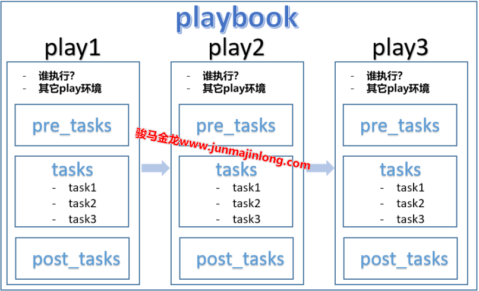
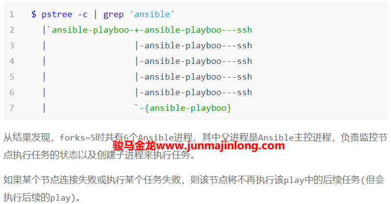

# 4. Ansible 的灵魂：playbook

- [4. Ansible 的灵魂：playbook](#4-ansible-的灵魂playbook)
  - [4.1 playbook、play 和 task 的关系](#41-playbookplay-和-task-的关系)
  - [4.2 playbook 的语法：YAML](#42-playbook-的语法yaml)
    - [4.2.1 对象](#421-对象)
    - [4.2.2 数组](#422-数组)
    - [4.2.3 字典](#423-字典)
    - [4.2.4 复合结构](#424-复合结构)
    - [4.2.5 字符串续行](#425-字符串续行)
    - [4.2.6 空值](#426-空值)
    - [4.2.7 YAML 中的单双引号和转义](#427-yaml-中的单双引号和转义)
  - [4.3 playbook 的写法](#43-playbook-的写法)
  - [4.4 playbook 模块参数的传递方式](#44-playbook-模块参数的传递方式)
  - [4.5 指定执行 play 的目标主机](#45-指定执行-play-的目标主机)
  - [4.6 默认的任务执行策略](#46-默认的任务执行策略)

ansible 命令每次只能执行一个任务，这种运行方式称为 Ad-hoc(点对点模式)，不考虑 Ansible 特性的话，这功能比 ssh 远程执行命令还要弱。

所以，Ansible 靠 ansible 命令是撑不起自动化管理这把大伞的，Ansible 真正强大的是 playbook，它才是 Ansible 撬动自动化管理的结实杠杆。

## 4.1 playbook、play 和 task 的关系

在前面介绍 inventory 的时候，我将它类比为演员表，在这里，我继续对 playbook、play 和 task 跟拍电影中的一些过程做个对比。

playbook 译为剧本，就像电影、电视剧的剧本一样，剧本中记录了电影的每一片段应该怎么拍，包括：拍之前场景布置、拍之后的清场、每一个演员说什么话做什么动作、每一个演员穿什么样的衣服，等等。

Ansible 的 playbook 也如此，电影的每一个片段可以对应于 playbook 中的每一个 play，每一个 play 都可以有多个任务(tasks)，tasks 可以对应于电影片段中的每一幕。所以，playbook 可以用来组织多个任务，然后让这些任务统一执行，就像 shell 脚本组织多个命令一样，这种组织多个事件、多个任务的行为，有一个更高大上的术语：”编排”。

还可以继续更细致的对应起来。比如每一个 play 都可以定义自己的环境，比如 play 级别的变量，对应于电影片段的场景布置，每一个 play 都需要指定要执行该 play 的主机，即先确定好这个电影片段中涉及的演员，每一个 Play 可以有 pre_tasks，对应于正式开拍之前的布置，每一个 play 可以有 post_tasks，对应于拍完之后的清场。

而我们人，既是编写 playbook 的编剧，也是让 playbook 跑起来的导演。

简单总结一下 playbook、play 和 task 的关系：

1. playbook 中可以定义一个或多个 play

2. 每个 play 中可以定义一个或多个 task
3. 其中还可以定义两类特殊的 task：pre_tasks 和 post_tasks
4. pre_tasks 表示执行执行普通任务之前执行的任务列表
5. post_tasks 表示普通任务执行完之后执行的任务列表
6. 每个 play 都需要通过 hosts 指令指定要执行该 play 的目标主机
7. 每个 play 都可以设置一些该 play 的环境控制行为，比如定义 play 级别的变量



例如，下面是一个 playbook 示例，文件名为 first.yml，内容如下：

```shell
---
- name: play 1
  hosts: nginx
  gather_facts: false
  tasks:
    - name: task1 in play1
      debug:
        msg: "output task1 in play1"

    - name: task2 in play1
      debug:
        msg: "output task2 in play1"

- name: play 2
  hosts: apache
  gather_facts: false
  tasks:
    - name: task1 in play2
      debug:
        msg: "output task1 in play2"

    - name: task2 in play2
      debug:
        msg: "output task2 in play2"
```

这个 playbook 中包含两个 play：”play 1”和”play 2”，每个 play 中又包含了两个 task。且执行”play 1”的是 nginx 主机组中的主机节点，执行”play 2”的是 apache 主机组中的主机节点。

使用 ansible-playbook 命令执行这个 playbook：

```shell
$ ansible-playbook first.yml
```

输出结果：

```shell
PLAY [play 1] **************************

TASK [task1 in play1] ******************
ok: [192.168.200.27] => {
    "msg": "output task1 in play1"
}
ok: [192.168.200.28] => {
    "msg": "output task1 in play1"
}
ok: [192.168.200.29] => {
    "msg": "output task1 in play1"
}

TASK [task2 in play1] ******************
ok: [192.168.200.27] => {
    "msg": "output task2 in play1"
}
ok: [192.168.200.28] => {
    "msg": "output task2 in play1"
}
ok: [192.168.200.29] => {
    "msg": "output task2 in play1"
}

PLAY [play 2] **************************

TASK [task1 in play2] ******************
ok: [192.168.200.30] => {
    "msg": "output task1 in play2"
}
ok: [192.168.200.31] => {
    "msg": "output task1 in play2"
}
ok: [192.168.200.32] => {
    "msg": "output task1 in play2"
}
ok: [192.168.200.33] => {
    "msg": "output task1 in play2"
}

TASK [task2 in play2] ******************
ok: [192.168.200.30] => {
    "msg": "output task2 in play2"
}
ok: [192.168.200.31] => {
    "msg": "output task2 in play2"
}
ok: [192.168.200.32] => {
    "msg": "output task2 in play2"
}
ok: [192.168.200.33] => {
    "msg": "output task2 in play2"
}

PLAY RECAP ****************************
192.168.200.27  : ok=2  changed=0  ......
192.168.200.28  : ok=2  changed=0  ......
192.168.200.29  : ok=2  changed=0  ......
192.168.200.30  : ok=2  changed=0  ......
192.168.200.31  : ok=2  changed=0  ......
192.168.200.32  : ok=2  changed=0  ......
192.168.200.33  : ok=2  changed=0  ......
```

首先执行的是 playbook 中的"play 1"，nginx 主机组(有 3 个节点)要执行这个 play，且这个 play 中有两个任务要执行，所以输出结果为：

```shell
PLAY [play 1] **************************

TASK [task1 in play1] ******************
ok: [192.168.200.27] => {}
ok: [192.168.200.28] => {}
ok: [192.168.200.29] => {}

TASK [task2 in play1] ******************
ok: [192.168.200.27] => {}
ok: [192.168.200.28] => {}
ok: [192.168.200.29] => {}
```

其中 ok 表示任务执行成功，且 PLAY 和 TASK 后面都指明了 play 的名称、task 的名称。

执行完"play 1"之后，执行"play 2"，apache 主机组(有 3 个节点)要执行这个 play，且这个 play 中有两个任务要执行，所以输出的输出结果和上面的类似。

最后输出的是每个主机执行任务的状态统计，比如某个主机节点执行成功的任务有几个，失败的有几个。

```shell
PLAY RECAP ****************************
192.168.200.27  : ok=2  changed=0  ......
192.168.200.28  : ok=2  changed=0  ......
192.168.200.29  : ok=2  changed=0  ......
192.168.200.30  : ok=2  changed=0  ......
192.168.200.31  : ok=2  changed=0  ......
192.168.200.32  : ok=2  changed=0  ......
192.168.200.33  : ok=2  changed=0  ......
```

## 4.2 playbook 的语法：YAML

ansible 的 playbook 采用 yaml 语法，它以非常简洁的方式实现了 json 格式的事件描述。yaml 之于 json 就像 markdown 之于 html 一样，极度简化了 json 的书写。

YAML 文件后缀通常为.yaml 或.yml。

YAML 在不少工具里都使用，学习它是”一次学习、终生受益”的，所以很有必要把 yaml 的语法格式做个梳理，系统性地去学一学。

YAML 的基本语法规则如下：

- 大小写敏感
- 使用缩进表示层级关系
- 缩进时不允许使用 Tab 键，只允许使用空格。
- 缩进的空格数目不重要，只要相同层级的元素左侧对齐即可
- yaml 文件可以以`---`作为文档的开始，表示这是一个 yaml 文件，没有使用`---`开头，也无任何影响
- `#`表示注释，从这个字符一直到行尾，都会被解析器忽略。
- 字符串不用加引号，但当可能产生歧义时，需要引号（单双引号皆可）
- 布尔值非常灵活，不区分大小写的 true/false, yes/no, on/off, y/n, 0/1 都允许

YAML 支持的数据结构有三种。

- 对象：键值对的集合，又称为映射（mapping）/ 哈希（hashes） / 字典（dictionary）
- 数组：一组按次序排列的值，又称为序列（sequence） / 列表（list）
- 纯量（scalars）：单个的、不可再分的值

更多详细内容可以参考 [_YAML_ 语言教程 - 阮一峰的网络日志](https://www.ruanyifeng.com/blog/2016/07/yaml.html)

可以去找一些在线 YAML 转换 JSON 网站，比如http://yaml-online-parser.appspot.com，通过在线转换可以验证或查看自己所写的YAML是否出错以及哪里出错。也可以安装yq(yaml query)命令将 yaml 数据转换成 json 格式数据。

```shell
yum -y install jq
pip3 install yq
用法：
cat a.yml | yq .
```

### 4.2.1 对象

一组键值对，使用冒号隔开 key 和 value。注意，冒号后必须至少一个空格。

```yaml
name: junmajinlong
```

等价于 json：

```json
{
  "name": "junmajinlong"
}
```

### 4.2.2 数组

```yaml
---
- Shell
- Perl
- Python
```

等价于 json：

```json
["Shell", "Perl", "Python"]
```

也可以使用行内数组(内联语法)的写法：

```yaml
["Shell", "Perl", "Python"]
```

再例如：

```yaml
---
- lang1: Shell
- lang2: Perl
- lang3: Python
```

等价于 json：

```json
[{ "lang1": "Shell" }, { "lang2": "Perl" }, { "lang3": "Python" }]
```

将对象和数组混合：

```yaml
---
languages:
  - Shell
  - Perl
  - Python
```

等价于 json：

```json
{
  "languages": ["Shell", "Perl", "Python"]
}
```

### 4.2.3 字典

```yaml
---
person1:
  name: junmajinlong
  age: 18
  gender: male

person2:
  name: xiaofanggao
  age: 19
  gender: female
```

等价于 json：

```json
{
  "person2": {
    "gender": "female",
    "age": 19,
    "name": "xiaofanggao"
  },
  "person1": {
    "gender": "male",
    "age": 18,
    "name": "junmajinlong"
  }
}
```

也可以使用行内对象的写法：

```yaml
person1: { name: junmajinlong, age: 18, gender: male }
```

### 4.2.4 复合结构

```yaml
---
- person1:
  name: junmajinlong
  age: 18
  langs:
    - Perl
    - Ruby
    - Shell

- person2:
  name: xiaofanggao
  age: 19
  langs:
    - Python
    - Javascript
```

等价于 json：

```json
[
  {
    "langs": ["Perl", "Ruby", "Shell"],
    "person1": null,
    "age": 18,
    "name": "junmajinlong"
  },
  {
    "person2": null,
    "age": 19,
    "langs": ["Python", "Javascript"],
    "name": "xiaofanggao"
  }
]
```

### 4.2.5 字符串续行

字符串可以写成多行，从第二行开始，必须至少有一个单空格缩进。换行符会被转为空格。

```yaml
str: hello
  world
  hello world
```

等价于 json：

```json
{
  "str": "hello world hello world"
}
```

也可以使用>换行，它类似于上面的多层缩进写法。此外，还可以使用|在换行时保留换行符。

```yaml
this: |
  Foo
  Bar
that: >
  Foo
  Bar
```

等价于 json：

```json
{ "that": "Foo Bar", "this": "Foo\nBar\n" }
```

### 4.2.6 空值

YAML 中某个 key 有时候不想为其赋值，可以直接写 key 但不写 value，另一种方式是直接写 null，还有一种比较少为人知的方式：波浪号~。

例如，下面几种方式全是等价的：

```yaml
key1:
key2: null
key3: Null
key4: NULL
key5: ~
```

### 4.2.7 YAML 中的单双引号和转义

YAML 中的字符串是可以不用使用引号包围的，但是如果包含了特殊符号，则需要使用引号包围。

单引号包围字符串时，会将特殊符号保留。

双引号包围字符串时，反斜线需要额外进行转义。

例如，下面几对书写方式是等价的：

```yaml
- key1: "~"
- key2: "~"

- key3: '\.php$'
- key4: "\\.php$"
- key5: \.php$

- key6: \n
- key7: '\n'
- key8: "\\n"
```

等价于 json：

```json
[
  { "key1": "~" },
  { "key2": "~" },
  { "key3": "\\.php$" },
  { "key4": "\\.php$" },
  { "key5": "\\.php$" },
  { "key6": "\\n" },
  { "key7": "\\n" },
  { "key8": "\\n" }
]
```

## 4.3 playbook 的写法

了解 YAML 写法之后，就可以来写 Ansible 的 playbook 了。

回顾一下前文对 playbook、play 和 task 关系的描述，playbook 可以包含一个或多个 play，每个 play 可以包含一个或多个任务，且每个 play 都需要指定要执行该 play 的目标主机。

于是，将下面这个 ad-hoc 模式的 ansible 任务改成等价的 playbook 模式：

```shell
$ ansible nginx -m copy -a 'src=/etc/passwd dest=/tmp'
```

假设这个 playbook 的文件名为 copy.yml，其内容如下：

```yaml
---
- hosts: nginx
  gather_facts: false

  tasks:
    - copy: src=/etc/passwd dest=/tmp
```

```shell
$ ansible-playbook copy.yml
```

再来解释一下这个 playbook 文件的含义。

playbook 中，每个 play 都需要放在数组中，所以在 playbook 的顶层使用列表的方式- xxx:来表示这是一个 play（此处是- hosts:）。

每个 play 都必须包含**hosts**和**tasks**指令。

hosts 指令用来指定要执行该 play 的目标主机，可以是主机名，也可以是主机组，还支持其它方式来更灵活的指定目标主机。具体的规则后文再做介绍。

tasks 指令用来指定这个 play 中包含的任务，可以是一个或多个任务，任务也需要放在 play 的数组中，所以 tasks 指令内使用- xxx:的方式来表示每一个任务（此处是- copy:）。

gather_facts 是一个 play 级别的指令设置，它是一个负责收集目标主机信息的任务，由 setup 模块提供。默认情况下，每个 play 都会先执行这个特殊的任务，收集完信息之后才开始执行其它任务。但是，收集目标主机信息的效率很低，如果能够确保 playbook 中不会使用到所收集的信息，可以显式指定 gather_facts: no 来禁止这个默认执行的收集任务，这对效率的提升是非常可观的。

此外每个 play 和每个 task 都可以使用 name 指令来命名，也建议尽量为每个 play 和每个 task 都命名，且名称具有唯一性。

所以，将上面的 playbook 改写：

```yaml
---
- name: first play
  hosts: nginx
  gather_facts: false

  tasks:
    - name: copy /etc/passwd to /tmp
      copy: src=/etc/passwd dest=/tmp
```

## 4.4 playbook 模块参数的传递方式

在刚才的示例中，copy 模块的参数传递方式如下：

```yaml
tasks:
  - name: copy /etc/passwd to /tmp
    copy: src=/etc/passwd dest=/tmp
```

这是标准的 yaml 语法，参数部分 src=/etc/passwd dest=/tmp 是一个字符串，当作 copy 对应的值。

根据前面介绍的 yaml 语法，还可以换行书写。有以下几种方式：

```yaml
name: first play
hosts: nginx
gather_facts: false
tasks:

  - copy:
    src=/etc/passwd dest=/tmp

  - copy:
    src=/etc/passwd
    dest=/tmp

  - copy: >
    src=/etc/passwd
    dest=/tmp

  - copy: |
    src=/etc/passwd
    dest=/tmp
```

除此之外，Ansible 还提供了另外两种传递参数的方式：

- 将参数和参数值写成 key: value 的方式
- 使用 args 参数声明接下来的是参数

通过示例便可对其用法一目了然：

```yaml
name: first play
hosts: nginx
gather_facts: false
tasks:
  - name: copy1
    copy:
      src: /etc/passwd
      dest: /tmp

  - name: copy2
    copy:
    args:
      src: /etc/passwd
      dest: /tmp
```

大多数时候，使用何种方式传递参数并无关紧要，只要个人觉得可读性高、方便、美观即可。

## 4.5 指定执行 play 的目标主机

每一个 play 都包含 hosts 指令，它用来指示在解析 inventory 之后选择哪些主机执行该 play 中的 tasks。

hosts 指令通过 pattern 的方式来筛选节点，pattern 的指定方式有以下几种规则：

1. 直接指定 inventory 中定义的主机名
   - hosts: localhost
2. 直接指定 inventory 中的主机组名
   - hosts: nginx
   - hosts: all
3. 使用组名时，可以使用数值索引的方式表示组中的第几个主机
   - hosts: nginx[1]:mysql[0]
4. 可使用冒号或逗号隔开多个 pattern
   - hosts: nginx:localhost
5. 可以使用范围表示法
   - hosts: 192.168.200.3[0:3]
   - hosts: web[A:D]
6. 可以使用通配符\*
   - hosts: \*.example.com
   - hosts: \*，这等价于 hosts: all
7. 可以使用正则表达式，需使用~开头
   - hosts: ~(web|db)\.example\.com

此外：

1. 所有 pattern 选中的主机都是包含性的，第一个 pattern 选中的主机会添加到下一个 pattern 的范围内，直到最后一个 pattern 筛选完，于是取得了所有 pattern 匹配的主机
2. pattern 前面加一个`&`符号表示取交集
   pattern1:&pattern2 要求同时存在于 pattern1 和 pattern2 中的主机
3. pattern 前面加一个!符号表示排除
   pattern1:!pattern2 要求出现在 pattern1 中但未出现在 pattern2 中

## 4.6 默认的任务执行策略

最后，再来简单探究一下默认情况下 Ansible 是以什么样的策略去控制多个节点执行多个任务的(如果你愿意，还可以将这个执行策略跟拍戏进行类比，我就不再多说了，毕竟我是 IT 攻城狮不是编剧也不是导演啊)。

假设有 10 个目标节点要执行某个 play 中的 3 个任务：tA、tB、tC。

默认情况下，会从 10 个目标节点中选择 5 个节点作为第一批次的节点执行任务 tA，第一批次的 5 个节点都执行 tA 完成后，将选择剩下的 5 个节点作为第二批次执行任务 tA。

所有节点都执行完任务 tA 后，第一批次的 5 节点开始执行任务 tB，然后第二批次的 5 个节点执行任务 tB。

所有节点都执行完任务 tB 后，第一批次的 5 节点开始执行任务 tC，然后第二批次的 5 个节点执行任务 tC。
整个过程如下：


这个流程图虽然简单形象，但是不严谨，稍后会解释为何不严谨。

这里提到的 5 个节点的数量 5，是由配置文件中 forks 指令的值决定的，默认值为 5。

```shell
$ grep 'fork' /etc/ansible/ansible.cfg
#forks          = 5
```

forks 指令用来指定 Ansible 最多要创建几个子进程来执行任务，每个节点默认对应一个 ansible-playbook 进程和 ssh 进程，例如 forks=5 表示最多创建 5 个 ansible-playbook 子进程。所以，forks 的值也代表了最多有几个节点同时执行任务。

例如，将 hosts 指令指定为 all，并将 gather_facts 指令取消注释，因为这个任务执行比较慢，方便观察进程列表。

```yaml
name: first play
hosts: all
#gather_facts: false
执行该playbook。
```

```shell
$ ansible-playbook test.yaml
```

然后在另外一个终端上去查看进程列表：



根据上面对 forks 指令的效果描述，前面的执行策略流程图并不严谨。因为 forks 的效果并不是选中一批节点，本批节点执行完任务才选下一批节点。forks 是保证最多有 N 个节点同时执行任务，但有的节点可能执行任务较慢。比如有 10 个节点，且 forks=5 时，第一批选中 5 个节点执行任务，假如第 1 个节点先执行完任务，Ansible 主控进程不会等待本批中其它 4 个节点执行完任务，而是直接创建一个新的 Ansible 进程，让第 6 个节点执行任务。
