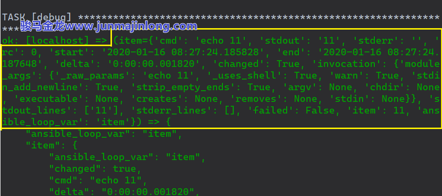
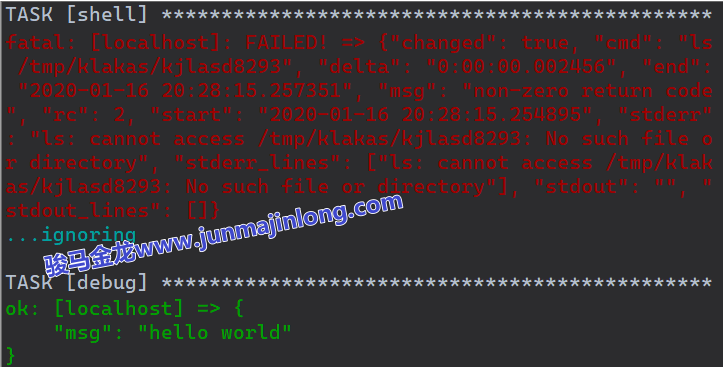
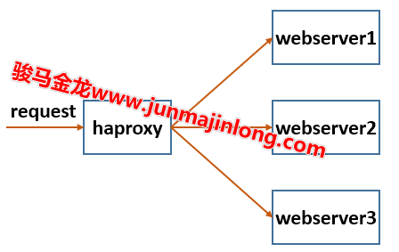
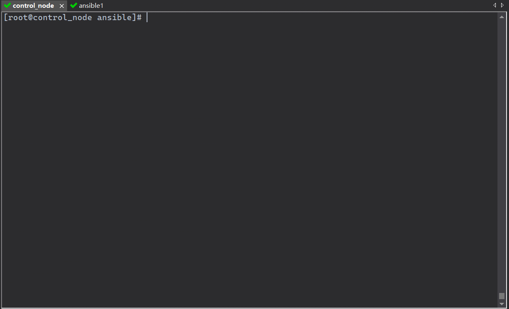

# 8. 回归 Ansible 并进阶：变量、条件、循环、异常处理及其它

- [8.回归 Ansible 并进阶：变量、条件、循环、异常处理及其它](#8回归-ansible-并进阶变量条件循环异常处理及其它)
  - [8.1 inventory 的进阶](#81-inventory-的进阶)
    - [8.1.1 inventory 解析](#811-inventory-解析)
    - [8.1.2 inventory 变量文件：host_vars 和 group_vars](#812-inventory-变量文件host_vars-和-group_vars)
    - [8.1.3 动态 inventory](#813-动态-inventory)
    - [8.1.4 临时添加节点：add_host 模块](#814-临时添加节点add_host-模块)
    - [8.1.5 group_by 运行时临时设置主机组](#815-group_by-运行时临时设置主机组)
    - [8.1.6 –limit 再次限制目标主机](#816-limit-再次限制目标主机)
  - [8.2 收集目标节点的信息：Facts](#82-收集目标节点的信息facts)
    - [8.2.1 如何收集 Facts 信息？](#821-如何收集-facts-信息)
    - [8.2.2 如何访问 Facts 信息？](#822-如何访问-facts-信息)
    - [8.2.3 local Facts](#823-local-facts)
    - [8.2.4 委托 Facts](#824-委托-facts)
    - [8.2.5 set_fact 模块](#825-set_fact-模块)
    - [8.2.6 Facts 缓存](#826-facts-缓存)
  - [8.3 Ansible 变量的进阶](#83-ansible-变量的进阶)
    - [8.3.1 访问列表、字典变量的两种方式](#831-访问列表字典变量的两种方式)
    - [8.3.2 –extra-vars 选项定义额外变量](#832-extra-vars-选项定义额外变量)
    - [8.3.3 inventory 变量](#833-inventory-变量)
    - [8.3.4 Role 变量](#834-role-变量)
    - [8.3.5 play 变量](#835-play-变量)
    - [8.3.6 task 变量](#836-task-变量)
    - [8.3.7 block 变量](#837-block-变量)
    - [8.3.8 Facts 信息变量](#838-facts-信息变量)
    - [8.3.9 预定义特殊变量](#839-预定义特殊变量)
    - [8.3.10 变量作用域](#8310-变量作用域)
  - [8.4 YAML 纯文本裸字符串](#84-yaml-纯文本裸字符串)
  - [8.5 handler 的进阶](#85-handler-的进阶)
  - [8.6 when 条件判断](#86-when-条件判断)
    - [8.6.1 同时满足多个条件](#861-同时满足多个条件)
    - [8.6.2 按条件导入文件](#862-按条件导入文件)
    - [8.6.3 when 和循环](#863-when-和循环)
  - [8.7 循环迭代的进阶](#87-循环迭代的进阶)
    - [8.7.1 with_list](#871-with_list)
    - [8.7.2 with_items 和 with_flattened](#872-with_items-和-with_flattened)
    - [8.7.3 with_indexed_items](#873-with_indexed_items)
    - [8.7.4 with_dict](#874-with_dict)
    - [8.7.5 with_together](#875-with_together)
    - [8.7.6 with_sequence](#876-with_sequence)
    - [8.7.7 with_subelements](#877-with_subelements)
    - [8.7.8 with_nested](#878-with_nested)
    - [8.7.9 with_random_choice](#879-with_random_choice)
    - [8.7.10 with_fileglob](#8710-with_fileglob)
    - [8.7.11 with_lines](#8711-with_lines)
    - [8.7.12 循环和 when](#8712-循环和-when)
    - [8.7.13 循环和 register](#8713-循环和-register)
    - [8.7.14 循环的控制：loop_control](#8714-循环的控制loop_control)
      - [1.label 参数](#1label-参数)
      - [2.pause 参数](#2pause-参数)
      - [3.index_var 参数](#3index_var-参数)
      - [4.loop_var 参数](#4loop_var-参数)
      - [5.extended 参数](#5extended-参数)
  - [8.8 异常和错误处理](#88-异常和错误处理)
    - [8.8.1 人为制造失败：fail 模块](#881-人为制造失败fail-模块)
    - [8.8.2 断言：assert 模块](#882-断言assert-模块)
    - [8.8.3 ignore_errors](#883-ignore_errors)
    - [8.8.4 failed_when](#884-failed_when)
    - [8.8.5 rescue 和 always](#885-rescue-和-always)
    - [8.8.6 any_errors_fatal](#886-any_errors_fatal)
      - [8.8.7 max_fail_percentage](#887-max_fail_percentage)
    - [8.8.8 处理连接失败(unreachable)的异常](#888-处理连接失败unreachable的异常)
    - [8.8.9 任务失败导致 handler 未执行](#889-任务失败导致-handler-未执行)
  - [8.9 其它 Ansible 流程控制逻辑的进阶](#89-其它-ansible-流程控制逻辑的进阶)
    - [8.9.1 until 和 retry](#891-until-和-retry)
    - [8.9.2 pause 模块暂停、休眠](#892-pause-模块暂停休眠)
    - [8.9.3 wait_for 模块和 wait_for_connection 模块](#893-wait_for-模块和-wait_for_connection-模块)

本文将系统性地介绍一些知识点，有些是前面文章提到过的，有些是还没提到但重要的。所以，本文既是总结旧知识，也是拓展新知识，总的来说就是围绕”系统性”这三个字将零散的知识点整理在一起，从而进阶 Ansible。

## 8.1 inventory 的进阶

在第三章曾介绍过 inventory，这里进行一些知识的补充。

### 8.1.1 inventory 解析

当 Ansible 开始执行时，首先读取 Ansible 配置文件来初始化进程自身的运行环境，然后读取 inventory 文件并解析 inventory，解析 inventory 过程大概包括以下几件事：

1. 读取 inventory 文件，可能是单个静态 inventory 文件，也可能是多个 inventory 文件，还可能是动态生成的 inventory
2. 整理节点，比如将嵌套子组包含的节点整理到父组中
3. 整理主机变量。比如将主机组变量整理到主机节点中，其中还包括解析 host_vars 目录和 group_vars 目录中的变量
4. 维护并填充一些 Ansible 预定义的特殊变量，比如 inventory\_ hostname, host_vars, group_names, inventory_dir,inventory_file 等待
5. 确定连接该节点时的行为变量，比如以什么用户连接、连接什么端口等等
6. ....

在没有看 Ansible 源码的情况下，没办法深入到解析 inventory 的细节中去，但可以通过 ansible-inventory 工具来观察 inventory 解析后的一部分成果，例如：

```shell
$ ansible-inventory -i inventory_lnmp --list
{
    "_meta": {
        "hostvars": {
            "192.168.200.42": { "phpfpm_port": 9000 },
            "192.168.200.43": { "phpfpm_port": 9000 },
            "192.168.200.44": { "phpfpm_port": 9000 }
        }
    },
    "all": {
        "children": [ "dev", "ungrouped" ]
    },
    "dev": {
        "children": [ "mysql", "nginx", "php" ]
    },
    "mysql": {
        "hosts": [ "192.168.200.44" ]
    },
    "nginx": {
        "hosts": [ "192.168.200.42" ]
    },
    "php": {
        "hosts": [ "192.168.200.43" ]
    }
}
```

### 8.1.2 inventory 变量文件：host_vars 和 group_vars

在 inventory 文件中可以直接定义主机变量或主机组变量。

例如：

```ini
# 在主机上直接定义变量
[dev]
192.168.200.42 aaa=333 bbb=444 ansible_port=22
192.168.200.43
192.168.200.44

# 在主机组上定义变量
[dev:vars]
xxx=555
yyy=666
ansible_port=22

# 也可以在特殊的主机组ungrouped和all上定义变量
[all]
zzz=777
```

主机变量除了可以直接定义在 inventory 文件中，还可以定义在和 inventory 文件同目录的 host_vars 和 group_vars 目录中，其中 host_vars 目录中定义主机变量，group_vars 目录中定义主机组变量。

例如，默认的 inventory 文件是/etc/ansible/hosts，那么可以在/etc/ansible 目录下创建 host_vars 和 group_vars 目录，并在其中创建一些主机/主机组的变量文件或变量目录：

```shell
$ tree /etc/ansible/
/etc/ansible/
├── ansible.cfg
├── hosts
├── group_vars
│   ├── all.yml         # all主机组变量文件
│   ├── nginx           # nginx主机组变量目录，其内所有文件都会被读取
│   │   ├── main.yml    # nginx的主配置变量文件
│   │   └── vhost.yml   # nginx的虚拟主机配置变量文件
│   └── php.yml         # php主机组变量文件
└── host_vars
    └── 192.168.200.42.yml  # 192.168.200.42节点的变量文件
```

上面的目录结构已经解释完所有内容了，这里总结下：

1. 定义在 group_vars/目录中的变量文件可以是普通文件(比如 all.yml、php.yml)，也可以是变量目录(比如 nginx 目录)

2. 如果是目录，则目录名必须和主机组名相同，目录中的所有文件都会在解析 inventory 的时候被读取
3. 如果是普通文件，则文件名可带可不带后缀，不带后缀时，文件名和主机组名相同，带后缀时，前缀和主机组名相同，后缀只允许.yml .yaml .json
4. host_vars/目录只能为每个节点都单独定义属于它们的变量文件

再来总结一下 group_vars/, host_vars/的存放位置：

1. inventory 文件的同目录

2. playbook 文件的同目录

所以，下面和 playbook 文件 lnmp.yml 同目录层次的 group_vars/也是有效的：

```shell
# tree -L 2 -F .
.
├── common.yml
├── group_vars/
│   └── all.yml
├── inventory_lnmp
├── lnmp.yml
├── mysql.yml
├── nginx.yml
├── php.yml
└── roles/
    ├── common/
    ├── mysql/
    ├── nginx/
    └── php/
```

这里有一个小小疑问？在 inventory 文件同目录下创建{group,host}\_vars/能理解，为什么还要支持在 playbook 同目录下允许这两个目录呢？主要原因还是为了扩充 Role 的能力。在第六章中曾说过，在 nginx Role 中想要跨 Role 访问 php Role 中的变量 phpfpm_port，其中方法之一也是最友好的方法，就是在 playbook 文件的同目录下提供{group,host}\_vars/，并在其中设置多个 Role 共享的变量。

换句话说，在 playbook 文件同层次的{group,host}\_vars/下定义主机或主机组变量，可以实现 playbook 全局变量的功能。任何人都能一眼看到这两个目录，而且只要看到 playbook 文件同目录下有这两个目录，就知道它们定义了全局变量，是所有 Role 都能访问到的变量。

如果各位尚不熟悉这两个目录，还请暂停下来自行动手测试一番，这里我不多做实验。后文也有不少地方不会给出测试代码，因为本文要介绍的深入和进阶内容众多，在文字已经描述清楚的情况下，加上实验代码会让文章篇幅变得非常大，万请各位理解。

### 8.1.3 动态 inventory

通常来说，将所有主机信息定义在静态 inventory 文件中已经能满足绝大多数需求。但是，在云计算”横行”的年代，动态获取 inventory 的能力也显得尤为重要。

那么何为静态 inventory，何为动态 inventory？答案非常简单：

- Ansible 在解析 inventory 的阶段去读取指定的文件来获取 inventory 信息，是静态 inventory

- Ansible 在解析 inventory 的阶段去执行指定的文件来获取 inventory 信息，是动态 inventory

看到不同的地方了吗？静态是读取，动态是执行。

所以，动态 inventory 可能是一个脚本，也可能是一个程序，只要能在 stdout 中输出符合 Ansible 要求的数据格式，即可作为动态 inventory 的来源。

一般情况下，动态 inventory 是由用户根据自己公司的场景需求来编写的，一般使用编程语言来完成这个任务。任何一门语言，甚至 Shell 脚本或某个别人已经写好的命令、工具都可以完成这个任务。编写动态 inventory 唯一的要求，是 Ansible 执行它时能够输出 Ansible 要求的数据格式。
在这里，我用所有运维人员都懂的 Shell 脚本来做一个简单的演示，目的仅仅只是为了让各位对动态 Inventory 有一个直观的感受如果要深入到动态 Inventory,可去官方手册或网上找些资料了解一番，这方面内容不难，但毕竟渉及到了编程知识，所以门槛就这么无情的立在这里

要编写动态 Inventory，Ansible 要求什么呢？它要求这个动态 inventory 程序能够使用--list 选项并输出一种数据格式。至于是何种数据格式，ansible-inventory --list 已经告诉我们了，它的输出格式，就是执行动态 inventory 加上--list 选项时应该输出的格式。

以下面这个 inventory 文件为例：

```Ini
[nginx]
192.168.200.42   nginx_var="NGINX_VAR"

[php]
192.168.200.43

[mysql]
192.168.200.44

[dev:children]
nginx
php
mysql

[dev:vars]
dev_var="DEV_VAR"

[all:vars]
all_var="ALL_VAR"
```

使用 ansible-inventory --list 得到的输出结果：

```shell
$ ansible-inventory -i static_inventory --list
{
    "_meta": {
        "hostvars": {
            "192.168.200.42": {
                "all_var": "ALL_VAR",
                "dev_var": "DEV_VAR",
                "first_var": "hello world",
                "nginx_var": "NGINX_VAR"
            },
            "192.168.200.43": {
                "all_var": "ALL_VAR",
                "dev_var": "DEV_VAR",
                "first_var": "hello world"
            },
            "192.168.200.44": {
                "all_var": "ALL_VAR",
                "dev_var": "DEV_VAR",
                "first_var": "hello world"
            }
        }
    },
    "all": {
        "children": [ "dev", "ungrouped" ]
    },
    "dev": {
        "children": [ "mysql", "nginx", "php" ]
    },
    "mysql": {
        "hosts": [ "192.168.200.44" ]
    },
    "nginx": {
        "hosts": [ "192.168.200.42" ]
    },
    "php": {
        "hosts": [ "192.168.200.43" ]
    }
}
```

所以，只要执行动态 inventory 程序并带上--list 选项能够输出这种数据格式，就是合格的动态 inventory 程序。

也就是说，如果我写一个 Shell 脚本能输出这段数据，那这个 Shell 脚本就是一个合格的 inventory 程序。

是否 so easy？比如，我将上面命令的输出结果保存在/tmp/a.ini 文件中：

```shell
$ ansible-inventory --list -i static_inventory >/tmp/a.ini
```

然后写一个 Shell 脚本 my_inventory.sh 读取这个文件并输出，内容如下：

```shell
#!/bin/bash

case "$1" in
  --list)
      cat /tmp/a.ini
esac
```

再给 Shell 脚本执行权限：

```shell
$ chmod +x my_inventory.sh
```

这个 Shell 脚本就是一个合格的动态 inventory 脚本。执行试试：

```shell
$ ansible -i my_inventory.sh nginx -m ping
192.168.200.42 | SUCCESS => {
    "ansible_facts": {
        "discovered_interpreter_python": "/usr/bin/python"
    },
    "changed": false,
    "ping": "pong"
}
```

再回头分析一下，编写动态 inventory 程序的一些基本要求。具体格式如下：

```
{
  _meta: {
    hostvars: {
    }
  },
  all:{
    children: [GROUP_NAME1,GROUP_NAME2...]
  }
  GROUP_NAME1:{
    hosts: [ HOST1, HOST2, ... ]
  },
  GROUP_NAME2:{
    hosts: [ HOST3, HOST4, ... ]
  }
}
```

其中子组通过 children 来定义，组内节点通过 hosts 来定义。如果要支持主机变量(不是主机组变量，组变量最终还是要整理到主机变量里去的)，就在\_meta 里的 hostvars 中定义。比如：

```json
hostvars: {
  "192.168.200.42": {
      "all_var": "ALL_VAR",
      "dev_var": "DEV_VAR",
      "first_var": "hello world",
      "nginx_var": "NGINX_VAR"
  },
  "192.168.200.43": {
      "all_var": "ALL_VAR",
      "dev_var": "DEV_VAR",
      "first_var": "hello world"
  }
}
```

另一个需要注意的是，如果要使用主机变量，还要求动态 inventory 程序支持--host 选项，这个选项用于返回属于该主机的变量。ansible-inventory 也告诉我们了。

```shell
$ ansible-inventory -i static_inventory --host 192.168.200.42
{
    "all_var": "ALL_VAR",
    "dev_var": "DEV_VAR",
    "first_var": "hello world",
    "nginx_var": "NGINX_VAR"
}
```

--host 选项是非强制性的，而刚才说的--list 是强制性的，必须提供。

关于动态 inventory 就介绍这么多，基本规则已经介绍完了，如果各位有编程基础，可自行尝试一番。

### 8.1.4 临时添加节点：add_host 模块

除了静态和动态 inventory 可以指定远程被控节点的信息，还有个比较特殊的模块 add_host，它可以在任务执行时临时添加主机节点。

add_host 用法非常简单，只有两个参数：name 和 groups，分别定义主机名和所在主机组，其中 groups 参数可以是一个列表，表示主机可以添加到多个组中。如果还有其它参数，则均被当作变量赋值。

```yaml
- name: add new host to nginx and apache
  add_host:
    name: 192.168.200.34
    groups:
      - nginx
      - apache
    ansible_port: 22
    my_var: "hello world"
```

add_host 模块是一个比较特殊的模块，它在 playbook 运行时添加主机，有以下几个注意事项：

- 新添加的主机在当前 play 中无效，只在之后的 play 中有效

- 它添加的主机只存在于内存中，Ansible 退出之后就消失

关于第一点，仔细一品便知为何，确定哪个主机执行任务是在解析 play 的时候确定的，每个 play 中执行任务的主机信息都保存在 play_hosts 预定义特殊变量中，而所有 Ansible 的预定义特殊变量都是 Ansible 内部在维护的，用户没有任何办法临时去改变这些变量(参考[官方手册页](https://docs.ansible.com/ansible/latest/reference_appendices/special_variables.html)的第一句话)。换句话说，它们对用户来说是只读变量。所以，用户模块 add_host 也没法临时去改变当前 play 的 play_hosts 值。但不知各位是否记得，Ansible 内部会动态维护该变量，比如当某个节点连接失败或执行任务失败时，会将此节点从该变量中移除。

演示一下 add_host 的用法。例如：

```yaml
---
# 在play1中添加新主机，并在当前play1中测试新主机是否可用
- name: add hosts in play1
  hosts: nginx
  gather_facts: false
  tasks:
    - name: add new host to nginx and php
      add_host:
        name: 192.168.200.44
        groups:
          - nginx
          - php
        ansible_port: 22
        my_var: "hello world"

    - name: ping nginx group in play1
      ping:

# 在play2和play3中分别测试nginx组和php组
- name: test new host in play2
  hosts: nginx
  gather_facts: false
  tasks:
    - name: ping nginx group
      ping:

- name: test new host in play3
  hosts: php
  gather_facts: false
  tasks:
    - name: ping php group
      ping:
```

上面使用 ping 模块去测试 Ansible 控制节点和目标主机之间是否可正常建立连接，该模块不需要任何参数。

上面 playbook 的执行结果中，将会显示 play2 和 play3 中都出现新主机 192.168.200.44，而在 play1 中的 ping 则不会出现 192.168.200.44。

### 8.1.5 group_by 运行时临时设置主机组

group_by 和 add_host 功能是类似的，group_by 用于临时设置主机组。

group_by 有两个参数：

- key：新设置的分组名

- parents：(可选参数)新增分组的父组

例如，当前的 inventory 如下：

```ini
[nginx]
192.168.200.42

[php]
192.168.200.43

[mysql]
192.168.200.44

[dev:children]
nginx
php
mysql
```

其中并没有”CentOS 7”和”CentOS 6”这两个主机组。现在想要在 playbook 运行的时候去设置这两个主机组。

```yaml
---
- name: set a new group
  hosts: all
  gather_facts: true
  tasks:
    - name: set new group
      group_by:
        key: "{{ansible_distribution}}_{{ansible_distribution_major_version}}"
        parents: "CentOS"

- name: use new group
  hosts: CentOS
  gather_facts: false
  tasks:
    - name: ping CentOS
      ping:
```

上面示例中 gather_facts 设置为 true，因为 group_by 任务中使用了两个需要它收集来的变量：ansible_distribution 和 ansible_distribution_major_version。

ansible_distribution 变量保存的是系统的发型名称，比如 CentOS、RedHat 等。

ansible_distribution_major_version 变量保存的是系统的主版本号，比如 CentOS 7.2 时返回主版本号 7。关于 gather_facts，会在稍后的进阶内容中详细介绍。

所以 key 参数渲染后的值(也即新增组的组名)应当类似于 CentOS_6、CentOS_7，而且它们都是 CentOS 的子组。

### 8.1.6 –limit 再次限制目标主机

默认情况下，所有被 ansible 或 ansible-playbook 选中的主机都会执行任务，但是可以使用命令行的--limit pattern 选项来筛选哪些主机执行任务哪些主机不执行任务。

这里需要注意一点：即使使用了--limit 选项，ansible 或 ansible-playbook 命令也总是会解析 Inventory 中的所有主机，只不过这两个命令可以从解析的 inventory 结果中选择部分要执行任务的节点(比如通过 hosts 指令)。

所以，总结下这里涉及到的解析和筛选节点的过程：

```
解析inventory --> play的hosts指令 --> limit选项
```

例如：

```yaml
---
- name: limit example play
  hosts: dev
  gather_facts: false
  tasks:
    - name: which host we are
      debug:
        var: inventory_hostname
```

上面 hosts 指令指定了 dev 组中的所有节点都执行任务，但下面执行 playbook 时指定--limit，限制只有 nginx 主机组中的节点才执行：

```shell
$ ansible-playbook -i inventory_lnmp --limit nginx limit.yaml
......
TASK [which host we are] *****************
ok: [192.168.200.42] => {
    "inventory_hostname": "192.168.200.42"
}
......
```

选项--limit pattern 的用法比较灵活，playbook 中 hosts 指令允许的规则都可以在此选项中使用。例如：

```yaml
--limit "host1,host2"
--limit 'all:!host1'
```

如果忘记了 hosts 指令的规则，可回到第四章中复习复习。

## 8.2 收集目标节点的信息：Facts

为了让 Ansible 更了解目标节点，可以让它去收集目标节点的信息，比如获取对方的主机名、系统版本、IP 地址或其它网卡信息、分区挂载信息等等。在 Ansible 中，收集到的这些节点信息称为 Facts。

有了这些信息，用户可以更好的控制管理节点，比如当 IP 地址为 xxx 时就怎样怎样，当系统是 CentOS 6 时怎样怎样，是 CentOS 7 时怎样怎样，等等。

有这些信息当然好，但是收集这些信息是有代价的，而且代价很大：因为要收集的信息量很大，所以收集的过程非常慢。所以，如果在 playbook 中用不上这些信息时，应当禁用收集行为，这也是一个非常有效的效率优化手段。

### 8.2.1 如何收集 Facts 信息？

在 Ad-hoc 模式的 ansible 命令中，可以使用 setup 模块或 gather_facts 模块来收集 Facts 信息。例如：

```shell
$ ansible localhost -m setup
$ ansible localhost -m gather_facts
```

各位执行一下，就会看到收集的信息非常多(至于如何使用这些信息，稍后解释)，而且收集的过程比较慢，会卡顿一段时间。

简单说明一下 setup 模块和 gather_facts 模块的区别。setup 模块是早就存在的模块，而 gather_facts 模块是 Ansible 2.8 才提供的，它是一个二次封装的模块，内部很可能就是调用 setup 模块，但为何还要提供 gather_facts 模块呢？也许原因就在于 gather_facts 模块相比 setup 模块多的一个功能：并行收集多个节点的信息，而且在探测到要收集多个节点信息时会自动并行。

既然 setup 和 gather_facts 是模块，那么它们也可以在 playbook 中当作任务来执行。但是 playbook 专门为此提供了一个 play 级别的指令：gather_facts。

对于 playbook 来说，只要用户没有在 play 级别上明确指定 gather_facts: BOOL_FALSE，Ansible 就总会在开始执行这个 play 的 pre_tasks 之前自动调用 setup 模块收集所有被选中的节点信息。

也就是说，如果 play 中有收集 Facts 的任务，那么这个 setup 模块的收集操作是 play 第一个要执行的任务。看执行结果便可知晓：

```shell
$ cat a.yml
---
- name: play1
  hosts: localhost
  tasks:

$ ansible-playbook a.yml
PLAY [play1] **************
TASK [Gathering Facts] ****
ok: [localhost]

PLAY RECAP
```

如果要在 playbook 中禁止收集信息，只需设置 gather_facts: false 即可，例如：

```yaml
---
- name: play1
  hosts: ...
  gather_facts: false
  tasks: ...
```

### 8.2.2 如何访问 Facts 信息？

收集到目标节点信息之后，各信息都保存在一个名为 ansible_facts 的变量中，所以可以直接 debug 去查看这个变量里保存了什么东西，也即收集了目标节点的哪些信息。

```yaml
- name: info in ansible_facts
  debug:
    var: ansible_facts
```

此外也可以直接使用下面的方式来查看 Facts 中收集了哪些信息：

```
$ ansible localhost -m 'setup'
```

下面是收集到的部分 Facts 信息：

```shell
{
    "ansible_facts": {
        "ansible_all_ipv4_addresses": [
            "192.168.200.26"
        ],
        "ansible_all_ipv6_addresses": [],
        "ansible_apparmor": {
            "status": "disabled"
        },
        "ansible_architecture": "x86_64",
        .................
        "ansible_date_time": {
            .............
        },
        "ansible_default_ipv4": {
            "address": "192.168.200.26",
            "alias": "eth0",
            "broadcast": "192.168.200.255",
            "gateway": "192.168.200.2",
            "interface": "eth0",
            "macaddress": "00:0c:29:50:25:bb",
            "mtu": 1500,
            "netmask": "255.255.255.0",
            "network": "192.168.200.0",
            "type": "ether"
        },
        "ansible_default_ipv6": {},
        "ansible_device_links": {
            "ids": {
                .............
            },
            "labels": {},
            "masters": {},
            "uuids": {
                "sda1": [
                    "367d6a77-033b-4037-bbcb-416705ead095"
                ],
                "sda2": [
                    "b2a70faf-aea4-4d8e-8be8-c7109ac9c8b8"
                ],
                "sda3": [
                    "d505113c-daa6-4c17-8b03-b3551ced2305"
                ]
            }
        },
        "ansible_devices": {        # 目标节点存储设备信息
            "sda": {
                "holders": [],
                "host": "SCSI storage controller:
                ............
                "model": "VMware Virtual S",
                "partitions": {
                    "sda1": {
                        ................
                        "sectors": "512000",
                        "sectorsize": 512,
                        "size": "250.00 MB",
                        "start": "2048",
                        "uuid": "367d6a77-033b-4037-bbcb-416705ead095"
                    },
                    "sda2": {
                        ................
                    }
                },
                .............
        },
        "ansible_distribution": "CentOS",    # 目标节点操作系统发行版本信息
        "ansible_distribution_file_parsed": true,
        "ansible_distribution_file_path": "/etc/redhat-release",
        "ansible_distribution_file_variety": "RedHat",
        "ansible_distribution_major_version": "7",
        "ansible_distribution_release": "Core",
        "ansible_distribution_version": "7.2",
        "ansible_dns": {
            "nameservers": [
                "192.168.200.2"
            ],
            "search": [
                "localdomain"
            ]
        },
        "ansible_domain": "",
        "ansible_effective_group_id": 0,
        "ansible_effective_user_id": 0,
        "ansible_env": {        # 目标节点可被Ansible获取到的环境变量
            "HISTCONTROL": "ignoredups",
            "HISTSIZE": "1000",
            "HOME": "/root",
            "HOSTNAME": "control_node",
            "LANG": "en_US.UTF-8",
            "LESSOPEN": "||/usr/bin/lesspipe.sh %s",
            "LOGNAME": "root",
            .....................
        },
        "ansible_eth0": {        # 目标节点的网卡信息
            "active": true,
            "device": "eth0",
            ......................
            "ipv4": {
                "address": "192.168.200.26",
                "broadcast": "192.168.200.255",
                "netmask": "255.255.255.0",
                "network": "192.168.200.0"
            },
            "macaddress": "00:0c:29:50:25:bb",
            ...................
        },
        "ansible_fibre_channel_wwn": [],
        "ansible_fips": false,
        "ansible_form_factor": "Other",
        "ansible_fqdn": "control_node",
        "ansible_hostname": "control_node",
        "ansible_hostnqn": "",
        "ansible_interfaces": [
            "lo",
            "eth0"
        ],
        .......................
        "ansible_mounts": [        # 目标节点的分区挂载信息
            {
                "block_available": 3907146,
                "block_size": 4096,
                "block_total": 4664064,
                "block_used": 756918,
                "device": "/dev/sda2",
                "fstype": "xfs",
                "inode_available": 18525156,
                "inode_total": 18666496,
                "inode_used": 141340,
                "mount": "/",
                "options": "rw,relatime,attr2,inode64,noquota",
                "size_available": 16003670016,
                "size_total": 19104006144,
                "uuid": "b2a70faf-aea4-4d8e-8be8-c7109ac9c8b8"
        ....................................
```

收集到的信息量非常大，但很幸运，只需关注其中常见的几项即可，比如系统版本号、主机名、IP 地址、分区信息、挂载信息。

有了这些信息，就可以去访问这些信息。由于它们都存放在 ansible_facts 变量中，所以通过这个变量去访问即可。但需要注意的是，对于收集到的绝大多数 Facts 信息，都有两种访问方式：

- 一种是 debug 查看 ansible_facts 变量得到的结果，这也是真正存储这些信息的方式
- 一种是命令行执行 setup 模块输出的方式

说的不太严谨，但是下面再解释加演示一下，就知道如何访问它们了。

直接使用 debug 模块去输出 ansible_facts 变量，即可知如何访问这些信息。例如：

```json
"ansible_facts": {
        "_facts_gathered": true,
        "all_ipv4_addresses": [ "192.168.200.26" ],
        "all_ipv6_addresses": [],
        "ansible_local": {},
        "architecture": "x86_64",
        .............
}
```

这也是 Ansible 真正存储这些信息的方式。于是，要获取目标主机上所有 IPv4 地址列表的方式为：

```yaml
- debug:
    var: ansible_facts.all_ipv4_addresses
```

要获取 eth0 和 lo 网卡的 ipv4 地址：

```yaml
- debug:
    var: ansible_facts.eth0.ipv4.address

- debug:
    var: ansible_facts.lo.ipv4.address
```

再看在 ansible 命令行中执行 setup 模块的输出信息，会发现原本 ansible*facts 内几乎所有顶级的 key 现在都以 ansible*开头，例如：

```json
"ansible_facts": {
        "ansible_all_ipv4_addresses": ["192.168.200.26"],
        "ansible_all_ipv6_addresses": [],
        ......
}
```

这是另一种访问 Facts 信息的方式。例如：

```yaml
- debug:
    var: ansible_all_ipv4_addresses

- debug:
    var: ansible_eth0.ipv4.address

- debug:
    var: ansible_lo.ipv4.address
```

之所以可以这样直接访问，是因为 Ansible 将 Facts 中绝大多数的顶级 key 都注入到了 Ansible 自身维护的变量表(即 hostvars)中，这样访问它们就方便的多。

至于采用何种方式访问，这无所谓，但是要知道的是，虽然绝大多数 Facts 信息都单独定义了变量，但并非所有(主要是那些可能产生歧义或冲突的变量)。

另外再多提醒一句，ansible_facts 自身也是变量，它也保存在各自节点的 hostvars 变量中，所以也可以通过 hostvars 去访问 Facts 信息。例如：

```yaml
- debug:
    var: hostvars['192.168.200.42']['ansible_facts'].lo.ipv4.address
```

前面介绍了访问 IP 地址信息的方式，除了获取 IP 地址，获取目标节点的系统版本号也是非常常见的需求：

```yaml
# 获取发行版名称，如CentOS
- debug:
    var: ansible_distribution

# 获取主版本号，如CentOS 7.2将返回7
- debug:
    var: ansible_distribution_major_version

# 获取完全版本号，如CentOS 7.2将返回7.2
- debug:
    var: ansible_distribution_version
```

举个例子，如果目标系统为 CentOS 6，就渲染 centos6.repo.j2 文件，如果目标是 CentOS 7 系统，就渲染 centos7.repo.j2 文件：

```yaml
---
- hosts: nginx
  gather_facts: true
  pre_tasks:
    - name: template and copy centos6 yum repo
      template:
        src: centos6.repo.j2
        dest: /tmp/centos6.repo
      when: ansible_distribution == "CentOS" and ansible_distribution_major_version == "6"

    - name: template and copy centos7 yum repo
      template:
        src: centos7.repo.j2
        dest: /tmp/centos7.repo
      when: ansible_distribution == "CentOS" and ansible_distribution_major_version == "7"
```

我想各位在这里都会觉得判断多次的方式非常冗余，没办法，Ansible 对 if...else 支持的并不友好，但好在 Ansible 提供了一种增强的 Jinja2 if 判断语句，它可以直接实现 if...else。

例如，改写上面的两个任务，将它们合并为一个 if...else：

```yaml
---
- hosts: nginx
  gather_facts: true
  pre_tasks:
    - name: template and copy yum repo
      template:
        src: "{{'centos6.repo.j2' if (ansible_distribution_major_version == 6) else 'centos7.repo.j2'}}"
        dest: /tmp/centos.repo
      when: ansible_distribution == 'CentOS'
```

关于 Jinja2，后面专门有一篇文章会深入介绍。

### 8.2.3 local Facts

Ansible 除了远程收集目标节点的 Facts 信息，还允许用户在目标节点上自定义该节点的 Facts 信息，这种方式收集到的 Facts 称为 local Facts。

要自定义 local Facts，需要在目标节点的/etc/ansible/facts.d/目录下创建以.fact 为后缀的文件，并在该文件中定义 Facts 变量信息。该文件要求是 json、ini 格式或能够输出 json、ini 数据格式的可执行文件，比如 shell 脚本。

local Facts 作为一种特殊的 Facts 信息，(直接或间接)调用 setup 模块时会自动将它们收集到 ansible_facts 变量的 ansible_local 中，所以访问 local_facts 就有两种方式：

```shell
ansible_facts.ansible_local.xxx
ansible_local.xxx
```

例如，在 192.168.200.42 节点上创建一个/etc/ansible/facts.d/a.ini 文件，内容如下：

```ini
[bb]
ccc=dddd
```

那么在 192.168.200.42 这个节点执行任务时，就可以访问到这个 local Facts 信息。例如：

```yaml
---
- name: play1
  hosts: nginx
  gather_facts: true
  tasks:
    - debug:
        var: ansible_local.a.bb.ccc
      when: inventory_hostname == "192.168.200.42"
    - debug:
        var: ansible_facts.ansible_local.a.bb.ccc
      when: inventory_hostname == "192.168.200.42"
```

或许我们会想，既然 Local Facts 的本质是自定义变量，为什么不直接在 Ansible 端用 host_vars 或 group_vars 或其它方式定义变量呢？

确实如此，使用 Local Facts 并不方便，这需要单独去目标节点创建/etc/ansible/facts.d/目录，还要将写好的.fact 文件拷贝过去，然后在下一个 play 中使用(如果在当前 play 中使用，需要先手动调用 setup 模块收集信息再使用)。

换句话说，使用 Local Facts 的一般流程可能是这样的：

```yaml
---
- name: play1
  hosts: nginx
  gather_facts: false
  tasks:
    - block:
        - name: mkdir /etc/ansible/facts.d
          file:
            name: /etc/ansible/facts.d
            state: directory
        - name: copy a.fact
          copy:
            src: a.fact
            dest: /etc/ansible/facts.d
      when: inventory_hostname == "192.168.200.42"

- name: play2 use local facts
  hosts: nginx
  gather_facts: true
  tasks:
    - debug:
        var: ansible_local.a.bb.ccc
      when: inventory_hostname == "192.168.200.42"
```

虽然 local Facts 不太方便，但由于它支持可执行文件的方式却为用户大开方便之门。用户可以直接写一个可执行文件来动态生成 Facts 信息而不是预先以静态的方式写好的 Facts 变量。下面先为各位展示一个示例，然后再来说它为什么能够提供便利。

假设现在已经写好了一个名为 a.fact 的 Shell 脚本(注意，可执行文件仍然以”.fact”为后缀)，内容如下：

```shell
#!/bin/bash
echo [bb]
echo ccc=dddd
```

然后测试：

```yaml
---
- name: play1
  hosts: nginx
  gather_facts: false
  tasks:
    - block:
        - name: mkdir /etc/ansible/facts.d
          file:
            name: /etc/ansible/facts.d
            state: directory
        - name: copy a.fact
          copy:
            src: a.fact
            dest: /etc/ansible/facts.d
            mode: 755
      when: inventory_hostname == "192.168.200.42"

- name: play2 use local facts
  hosts: nginx
  gather_facts: true
  tasks:
    - debug:
        var: ansible_local.a.bb.ccc
      when: inventory_hostname == "192.168.200.42"
```

注意上面 copy 模块中加的 mode: 755，因为可执行文件要有可执行权限。

为什么可执行文件方式的动态 local Facts 很方便呢？通常情况下，要定义动态变量，都需要手动去写动态 inventory 或变量插件，而这些定义方式都比编写可执行 local Facts 文件要复杂的多。

例如，想要收集 mysql galera 集群中节点的状态，编写如下可执行 Facts 文件：

```shell
#!/bin/bash

echo '[cluster_status]'
mysql -e "SHOW GLOBAL STATUS LIKE 'wsrep_cluster_status'\G" | awk '/Value/{print "status="$2}'
```

之后便可以在 playbook 中使用 ansible_local.FACT_FILENAME.cluster_status.status 来访问对应节点的状态。

虽然有其它方式实现同样的功能，但对于介绍 local Facts 的应用场景，这是一个非常不错的案例。

最后要说明的是，虽然 local Facts 有时候确实带来了方便，但按照一般使用流程，初次使用时有可能需要多次收集 Facts(要么当前 play 中手动收集一次，要么下一个 play 中收集使用)，而收集 Facts 的效率非常低，所以要考虑清楚是否要使用 Local Facts。稍后会介绍 Facts 缓存，来缓解 Facts 效率低下的问题。

### 8.2.4 委托 Facts

在此之前所介绍的收集 Facts 信息，都是调用 setup 收集目标节点的 Facts 信息。Ansible 还支持使用 delegate_facts: true 和 delegate_to 指令将 setup 收集任务委托给其它节点，使得 Ansible 收集其它节点的 Facts 信息。

给一个官方手册上的示例解释足以：

```yaml
---
- hosts: app_servers
  tasks:
    - name: gather facts from db servers
      setup:
      delegate_to: "{{item}}"
      delegate_facts: True
      loop: "{{groups['dbservers']}}"
```

上面的示例表示，当 app_servers 主机组中的节点执行任务时，都委托 dbservers 组中的所有节点去执行 setup 模块的任务，并让它们将 Facts 信息返回给 Ansible 端。于是 Ansible 端就收集到了 dbservers 组中节点的 Facts 信息，而不是 app_servers 组中节点的 Facts 信息，比如可以使用 hostvars[dbhost1].ansible_default_ipv4.address 来查看 dbhost1 节点的 ipv4 信息。

注意上面的指令结合，delegate_to 表示将 setup 模块任务委托给谁，此处是委托给 dbservers 的每一个节点，由于 setup 任务相比其它任务要特殊一点，它要将一些信息返回给 Ansible 端进行设置，所以还需使用 delegate_facts 指令来告诉 Ansible。

什么场景下需要委托 Facts？一般情况下都不需要，在集群管理时可能会用上。

### 8.2.5 set_fact 模块

经过前面的描述，我想大家都已经体会到了，Facts 的各种信息实际上是以变量方式保存的。

其实 Ansible 也允许用户在任务中通过 set_fact 模块直接定义 Facts，其效果就是定义了一个变量，和 register 指令的功能类似，只不过 register 指令是将模块的执行返回值赋值给变量名，而 set_fact 是手动指定变量的值。

一个示例便能解释清楚：

```yaml
---
- hosts: localhost
  gather_facts: false
  tasks:
    - name: define some variables
      set_fact:
        x: xx
        y: yy

    - name: use variable
      debug:
        msg: "x: {{x}}, y: {{y}}"
```

set_fact 经常用于临时设置变量，也非常方便，比如可以在将 shell 执行结果通过 register 注册变量之后，立即使用 set_fact 将命令的标准输出定义成变量。如下：

```yaml
---
- hosts: localhost
  gather_facts: false
  tasks:
    - shell: |
        echo hahahaha
      register: echo_res
    - set_fact: echo_var={{echo_res.stdout}}

    - name: use variable
      debug:
        var: echo_var
```

### 8.2.6 Facts 缓存

前面多次提到，收集 Facts 是一个非常低效的操作，别说用 Ansible 去管理上百上千台服务器，就算是几十台，如果都要先去收集 Facts 然后再执行任务，也将是一个噩梦。

好在，Ansible 支持 Facts 缓存，通过设置 Ansible 配置文件，然后就可以在任何时间点通过一个独立的收集任务去收集，并将收集的 Facts 缓存下来，以后使用 Facts 变量时就不用再显式地低效收集。

配置 Ansible 开启 Facts 缓存的方式非常简单，修改 Ansible 配置文件(默认是/etc/ansible/ansible.cfg 或其它位置)。目前 Ansible 支持以下几种缓存模式：

- (1).redis：缓存在 redis 服务中，直到目前(Ansible 2.9)为止，Ansible 还不支持指定连接 redis 的端口、密码等

- (2).memcached：缓存在 memcache 文件中
- (3).mongodb：缓存在 mongodb 文件中
- (4).jsonfile：缓存在本地的 json 文件中
- (5).yaml：缓存在本地的 yaml 文件中
- (6).pickle：缓存在本地的 pickle 序列化文件中

配置方式，可参考如下配置项：

```Ini
# jsonfile缓存模式
gathering = smart或explicit或implicit
fact_caching = jsonfile
fact_caching_connection = DIRNAME
fact_caching_timeout=TIMEOUT

# redis缓存模式
gathering = smart或explicit或implicit
fact_caching = redis
fact_caching_timeout=TIMEOUT
fact_caching_connection = localhost:6379:0

# mongodb缓存模式
fact_caching = mongodb
fact_caching_timeout = 60
fact_caching_connection = mongodb://localhost:32770/ansible_cache
```

简单说明下涉及到的配置指令的含义：

1. gathering：控制 Ansible 是否自动收集 Facts，它有三种值：

   1. implicit：这是默认值，表示执行 play 时会自动收集 Facts，除非显式指定 gather_facts: false 禁止收集
   2. explicit：不自动收集 Facts，除非显式指定 gather_facts: true 开启收集
   3. smart：自动收集 Facts，但如果已存在(缓存)则不重复收集

2. fact_caching_connection：指定本地目录用于存放 Facts 的缓存文件，如果目录不存在则 Ansible 会尝试创建
3. fact_caching_timeout：缓存的有效时长

根据上面的描述，想要使用缓存，需要将 gathering 设置为 smart，或 explicit，或 implicit 时 gather_facts: false 禁用自动收集，总的来说就是不要让它再次收集。

以 jsonfile 的缓存模式举个简单的示例，设置如下：

```ini
gathering = explicit
fact_caching = jsonfile
fact_caching_connection = /etc/ansible/facts_cache
fact_caching_timeout=86400
```

使用的 inventory 文件名为 hosts，其内容如下：

```ini
[nginx]
192.168.200.42
[mysql]
192.168.200.44
```

通过 Ad-hoc 的方式调用 setup 模块或 gather_facts 模块手动收集一次 Facts：

```shell
$ ansible -i hosts all -m setup
```

它会将收集到的内容缓存在/etc/ansible/facts_cache 目录下：

```shell
$ ls -l /etc/ansible/facts_cache/
-rw-r--r-- 1 root root 19032 Jan 14 12:00 192.168.200.42
-rw-r--r-- 1 root root 18940 Jan 14 12:00 192.168.200.44
```

可见，各目标节点的 Facts 缓存在以它主机名命名的文件中。

既然缓存下来了，之后便可以直接去引用这些缓存下来的 Facts 信息，甚至访问不在该 play 中的节点的 Facts 信息。例如，playbook 内容如下：

```yaml
---
- hosts: nginx
  gather_facts: false
  tasks:
    - name: use variable
      debug:
        var: ansible_default_ipv4.address

    - debug:
        var: hostvars['192.168.200.44'].ansible_default_ipv4.address
```

这里说明一下，只要进行了收集任务(无论是自动收集还是手动收集)，都会创建或更新 Facts 缓存。而收集操作很耗时间，所以比较推荐的方式是单独使用 Ad-hoc 的方式调用 setup 或 gather_facts 模块来收集，并且尽可能放在比较空闲的时间段进行收集操作。

## 8.3 Ansible 变量的进阶

前面的文章中我曾多次提到过 Ansible 的变量很复杂，是一个难点，也是一个重点。确实非常难，因为 Ansible 的变量来源太多了，据[官方手册](https://docs.ansible.com/ansible/latest/user_guide/playbooks_variables.html#variable-precedence-where-should-i-put-a-variable)对变量优先级的介绍，提到了有 47 处变量来源，所以这个知识点是非常零散的。我以前写博客翻阅手册时看到这个说明，整个人瞬间都不好了，不知道该怎么动笔。所以这里建议各位，不要全学，不要问用什么变量、为什么用这种变量，这是在给自己找罪。

其实，在前面的一些文章中介绍过不少变量类型，比如 inventory 变量、预定义特殊变量、vars_files 变量，等等，这些变量类型已经扮演了 Ansible 的主要角色，足够一般情况下使用 Ansible。而且，当我们需要使用到变量时，一般都能够在编写 playbook 时就确定变量类型，并在必要的时候(比如调试、重构 Role)根据需求调整变量的定义位置。

在本文，将对变量做个总结，并将它们系统性地完善完善，以便大家能够更好地掌握 Ansible 变量。

### 8.3.1 访问列表、字典变量的两种方式

Ansible 中经常需要访问列表和字典类型的变量。例如下面的字典类型：

```yaml
p:
  a: aa
  b: bb

files:
  - /tmp/a.txt
  - /tmp/b.txt
```

对于这类变量的访问，Ansible 中提供了两种方式：

1. 按照 Python 字典或列表的索引下标方式访问。例如 p["a"]、files[0]
2. 按照对象访问方式。例如 p.b、files.0

用一个简单的示例来演示一下这两种访问变量的方式：

```yaml
---
- hosts: localhost
  gather_facts: false
  tasks:
    - debug:
        msg: "name: {{p.name}}, age: {{p['age']}}"
      vars:
        p:
          name: "junmajinlong"
          age: 18
```

通常情况下，这两种访问方式都不会有问题。但对于访问字典来说，如果字典的 key 名称和 Python 的字典方法名冲突了，就会有问题。比如：

```yaml
p:
  keys: "junmajinlong"
  age: 18
```

因为 Python 的字典类型有一个称为 keys 的方法名，如果用 p.keys 来访问这个字典变量，得到的是 Python 的 keys 方法还是 keys 的值呢？答案是 keys 方法而不是 keys 属性的值。原因如下：

- 使用 X.Y 时，先搜索 Python 字典对象的属性名或方法名，搜索不到时再搜索 Jinja2 变量
- 使用 X["Y"]时，先搜索 Jinja2 变量，搜索失败时再搜索 Python 字典对象的属性名或方法名

所以，使用 X.Y 方式时需要小心一些，使用 X["Y"]更保险，但需要多敲几个按键。当然，使用哪种方式都无所谓，这都不是事，即使出错了也知道如何去调整。

### 8.3.2 –extra-vars 选项定义额外变量

ansible-playbook 命令的-e 选项或--extra-vars 选项可定义变量或引入变量文件。

```yaml
# 定义单个变量
$ ansible-playbook -e 'var1="value1"' xxx.yml

# 定义多个变量
$ ansible-playbook -e 'var1="value1" var2="value2"' xxx.yml

# 引入单个变量文件
$ ansible-playbook -e '@varfile1.yml' xxx.yml

# 引入多个变量文件
$ ansible-playbook -e '@varfile1.yml' -e '@varfile2.yml' xxx.yml
```

因为是通过选项的方式来定义变量的，所以它所定义的变量是全局的，对所有 play 都有效。

通常来说不建议使用-e 选项，因为这对用户来说是不透明也不友好的，要求用户记住要定义哪些变量。

### 8.3.3 inventory 变量

在解析 inventory 时，会收集 inventory 相关的变量。

inventory 变量主要分为两种：

1. 连接目标节点时的行为控制变量，即决定如何连接目标节点
2. 主机变量

行为控制变量(如 ansible_port、ansible_host 等)用于指定 Ansible 端连接目标节点时的连接参数，可设置的参数项比较多，可参见官方手册：[Connecting to hosts: behavioral inventory parameters](https://docs.ansible.com/ansible/latest/user_guide/intro_inventory.html#connecting-to-hosts-behavioral-inventory-parameters)。

inventory 的主机变量有多种定义途径，例如直接在 inventory 文件中为某个主机定义变量，也可以在主机组中定义变量，主机组变量会在解析 inventory 的时候整理到主机变量中去。此外还可以将变量定义在 host_vars/和 group_vars/目录内，详细用法参见前文。

需要说明或提醒几点：

1. 不要忘记 all 主机组的存在，为 all 主机组设置变量表示为所有节点设置主机变量
2. 主机变量是绑定在主机上的，和 play、task 没有关系，所以这些变量都是全局变量，甚至节点 A 执行任务时还能访问节点 B 的主机变量
3. 所有的主机变量都可以通过 ansible-inventory 工具列出来
4. 所有变量，包括主机变量，都保存在 Ansible 的变量表 hostvars 中，通过这个全局变量表，任何一个节点都能访问其它节点的变量

### 8.3.4 Role 变量

Role 中主要有两个地方定义变量：

1. roles/ROLE_NAME/defaults/main.yml
2. roles/ROLE_NAME/vars/main.yml

需要提醒大家，Role defaults 变量的优先级非常低，几乎可以被其它任何同名变量覆盖。

Role 变量都是 play 级别的变量。换句话说，如果 play 中执行了 Role 之后还有 tasks 指令的任务，则 tasks 的任务中可以引用 Role 中的变量。

例如：

```yaml
---
- hosts: localhost
  gather_facts: false
  roles:
    - role: test_role
  tasks:
    - debug:
        var: var_from_role
```

### 8.3.5 play 变量

play 级别可以通过 vars、vars_files、vars_prompt 指令来定义变量。因为它们属于 play 级别，所以只在当前 play 有效。另一方面，每个 play 都有选中的目标节点，所以所有选中的目标节点都能访问这些 play 变量。

关于 vars 和 vars_files 前面的文章中已经解释过，所以不再解释，这里简单介绍下 vars_prompt 指令的用法。

vars_prompt 指令用于交互式提示用户输入数据，并将输入内容赋值给指定的变量。

例如：

```yaml
---
- hosts: localhost
  gather_facts: false
  vars_prompt:
    - name: username
      prompt: "Your Name?"
      private: no
      default: "root"

    - name: passwd
      prompt: "Your Password"
  tasks:
    - debug:
        msg: "username: {{username}}, password: {{passwd}}"
```

上面定义了两个变量 username 和 passwd，都会提示用户输入对应的值。private: no 表示不要隐藏用户输入的字符(默认会隐藏)，default 表示指定变量的默认值。

vars_prompt 主要用于保护隐私数据，比如密码，有时候也用于交互式选择，比如让用户自己输入要安装的软件包名称。它的用法不难，更详细的用法参见官方手册：[Interactive input: prompts](https://docs.ansible.com/ansible/latest/user_guide/playbooks_prompts.html)

### 8.3.6 task 变量

task 变量有多种定义方式，稍作总结：

- (1).register 指令

- (2).set_fact 指令
- (3).vars 指令
- (4).include_vars 指令

它们的用法都介绍过，下面给个示例看一眼即可：

```yaml
---
- hosts: localhost
  gather_facts: false
  tasks:
    # var.yml变量文件中定义了变量a
    - include_vars:
        file: var.yml

    - shell: echo junmajinlong
      register: res
    - set_fact: name="{{res.stdout}}"

    - debug:
        msg: "a: {{a}}, name: {{name}}, age: {{age}}"
      vars:
        age: 18
        gender: male
```

### 8.3.7 block 变量

block 作为一个特殊的层次级别，它也支持定义变量，只不过这个 block 层次的变量只对当前 block 内的所有任务有效。

例如：

```yaml
---
- hosts: localhost
  gather_facts: false
  tasks:
    - block:
        - debug:
            var: name
      vars:
        name: "junmajinlong"
```

### 8.3.8 Facts 信息变量

Facts 信息也算是变量，这个变量比较特殊：看上去它是在 play 开始执行后才获取的，但它却是归属于每个主机的；它是一个任务，但它又在 play 级别解析且在所有任务中都有效……

关于 Facts，我想前文介绍的已经非常详细，所以不再多作解释。

### 8.3.9 预定义特殊变量

Ansible 作为一个功能复杂的程序，它自身也维护了一些暴露给用户的预定义变量，这些变量都是特殊变量(官方也称为魔法变量)，它们都是能直接访问的变量，且对用户只读。其实在之前的文章中已经接触了好几个这类变量，比如 hostvars。

这些变量的数量不少，大概 30-40 个左右，其中有一些是等价的变量(和 Ansible 版本的迭代有关)，这些变量当然不用全都去学习，但是了解一些常用变量的功能还是必要的(其实只要知道常用的几个即可，在写 playbook 的时候如果想要用关于 play、role、task、inventory、host 等 Ansible 内部信息，你肯定会想到去查找预定义变量)。

下面我列出常见预定义变量的含义，完整的预定义特殊变量说明参考官方手册：[Special Variables](https://docs.ansible.com/ansible/latest/reference_appendices/special_variables.html#special-variables)。这里我只解释变量含义，大多数变量都见名知意，且一些变量在前面文章中详细介绍过，如仍有疑惑，可用 debug 模块调试 hostvars 来观察变量的值或网上搜索寻求答案。

```shell
- ansible_forks
表示最大的进程数。这也暗含了多少个节点作为一批。(如果忘记了一批是什么意思，可回介绍playbook的那一章末尾复习)

- hostvars
保存了inventory中所有主机和主机变量

- inventory_hostname
当前执行任务的节点在inventory中的主机名

- inventory_hostname_short
当前执行任务的节点在inventory中的短主机名

- inventory_dir
inventory文件所在的目录

- inventory_file
inventory文件名

- group_names
当前正在执行任务的节点所在主机组列表，注意是一个列表，因为一个节点可能存在于多个主机组

- groups
inventory中所有的主机组以及各组内的主机列表

- ansible_play_batch
当前play中可执行任务的主机列表。Ansible动态维护该变量，默认情况下执行任务失败或连接失败的节点会从此变量中移除

- ansible_play_hosts
等价于ansible_play_batch

- play_hosts
已废弃，等价于ansible_play_batch

- playbook_dir
playbook所在目录，该playbook是ansible-playbook命令所执行的playbook，而不是import_playbook导入的playbook

- ansible_play_name
当前正在执行的play的name。Ansible 2.8才添加的变量

- ansible_play_hosts_all
当前play所选中的所有节点，等价于ansible_play_batch + 失败的节点

- ansible_play_role_names
当前play中包含的Role列表。注意，因依赖关系而隐式导入的Role不在列表内

- role_names
已废弃，等价于ansible_play_role_names

- ansible_role_names
当前play中包含的Role列表，包括因依赖关系而隐式导入的Role

- role_name
当前正在执行的Role的名称

- role_path
当前正在执行的Role的路径

ansible_run_tags
所有--tags筛选出来的tag列表

ansible_skip_tags
所有--skip_tags筛选出来的tag列表

ansible_version
Ansible版本号信息，是一个字典，字典的key: full, major, minor, revision以及string

- omit
这是一个非常特殊的变量，可直接忽略一个模块的参数。通常结合Filter和`default(omit)`使用。用法见下文
```

下面介绍下 omit 变量的用法。

```yaml
- name: touch files with an optional mode
  file:
    dest: "{{ item.path }}"
    state: touch
    mode: "{{ item.mode | default(omit) }}"
  loop:
    - path: /tmp/foo
    - path: /tmp/bar
    - path: /tmp/baz
      mode: "0444"
```

上面的示例通过迭代的方式创建多个文件，其中迭代创建前两个文件时，将以 umask 值来设置所创建文件的权限，而第三个文件因为存在 mode，所以将权限设置为 0444。的作用是：如果 item.mode 不存在，则忽略 file 模块的 mode 参数，否则 mode 参数则生效。

### 8.3.10 变量作用域

前面介绍了几种主要的变量类型，除了需要知道它们的用法之外，还需要搞清楚这些变量的生效范围，也即它们的作用域。其实在前面介绍各种变量的时候都提到过它们各自的生效范围，这里做个总结。

Ansible 中变量主要有五种作用域概念：

- (1).全局作用域：Ansible 配置文件、环境变量、命令行选项-e,--extra-vars 设置的变量都是全局变量

- (2).Play 作用域：整个 Play 中都有效的变量，vars_files、vars_prompt、play 级别的 vars 以及 Role 的变量，它们都是 play 级别的变量
- (3).主机变量：绑定在各主机上的变量，各种方式定义的 inventory 变量、Facts 信息变量(这个就划分在这吧)、set_fact、register、include_vars 都是主机变量
- (4).任务变量：只在当前任务中生效的变量，task 级别的 vars 定义的变量属于任务变量
- (5).block 变量：只在当前 block 内生效，block 级别的 vars 定义的变量属于 block 变量

最后还有预定义特殊变量未分类，这些变量由 Ansible 自身内部维护，有些是全局变量，有些是 play 变量，有些是主机变量，所以不方便对它们分类。

## 8.4 YAML 纯文本裸字符串

由于 Ansible 采用 Jinja2 模板引擎渲染字符串，在需要渲染的时候，如果发现字符串中包含了 Jinja2 的特殊字符，就会认为这是一个需要渲染的内容。比如是 Jinja2 的表达式语法(比如引用变量)，都是 Jinja2 的特殊符号。

如果想要在定义变量时、指定 name 属性值时或其它会渲染的地方使用这些 Jinja2 的特殊符号，需要加上!unsafe 标记。这个标记会禁止渲染，保留原始的特殊符号。

多说无益，示例之：

```yaml
---
- hosts: localhost
  gather_facts: false
  tasks:
    - name: !unsafe "hello {{ world" # 去掉!unsafe标记会报错
      debug: var=myvar
      vars:
        myvar: !unsafe "hello }} world" # 去掉!unsafe标记会报错
```

## 8.5 handler 的进阶

之前的文章已经详细介绍过 handler，这里再对其做一点补充：如何触发多个 handler 任务。

另外，还有一个关于”如何解决因某任务失败而导致 handler 未执行”的问题，该内容将在后文介绍异常和错误处理的时候再做补充。

如何触发执行多个 handler 任务？比如，将重启 nginx 的 handler 分为多步：

1. 检查 nginx 语法

2. 检查 nginx 进程是否已存在
3. 如果 nginx 进程已存在，则 reload
4. 如果 nginx 进程还不存在，则 start

第一种实现方式：在 handler 任务中使用 notify，将多个任务链在一起。

```yaml
# check config file syntax
- name: "reload nginx step 1"
  shell: |
    nginx -c /etc/nginx/nginx.conf -t
  changed_when: true
  notify: "reload nginx step 2"

# check nginx process is started or not
- name: "reload nginx step 2"
  shell: |
    killall -0 nginx &>/dev/null
  notify:
    - "start nginx"
    - "reload nginx"
  changed_when: true
  register: step2
  failed_when: false

# start nginx when nginx process is not running
- name: "start nginx"
  shell: |
    nginx -c /etc/nginx/nginx.conf
  when: step2.rc == 1

# reload nginx when nginx is running
- name: "reload nginx"
  shell: |
    nginx -s reload -c /etc/nginx/nginx.conf
  when: step2.rc == 0
```

第二种方式，在触发 handler 处定义 handler 列表：

```yaml
- template:
    src: nginx.conf.j2
    dest: /etc/nginx/nginx.conf
  notify:
    - check nginx syntax
    - check nginx process
    - start nginx
    - reload nginx
```

注意，handler 任务的执行顺序不是根据 notify 顺序决定的，而是根据 handler 任务的定义顺序。

然后定义如下 handlers：

```yaml
- name: "check nginx syntax"
  shell: |
    nginx -c /etc/nginx/nginx.conf -t
  changed_when: true

- name: "check nginx process"
  shell: |
    killall -0 nginx &>/dev/null
  changed_when: true
  register: step2
  failed_when: false

- name: "start nginx"
  shell: |
    nginx -c /etc/nginx/nginx.conf
  when: step2.rc == 1

- name: "reload nginx"
  shell: |
    nginx -s reload -c /etc/nginx/nginx.conf
  when: step2.rc == 0
```

第三种方式，在每个 handler 任务中使用 Ansible 2.2 提供的 listen 指令，它可以监听 notify 发送的信息：

```yaml
- template:
    src: nginx.conf.j2
    dest: /etc/nginx/nginx.conf
  notify: start or reload nginx
```

然后定义如下 handlers，每个 handler 都定义 listen: start or reload nginx，只要 notify 发送 start or reload nginx，则这些任务都会被触发。

```yaml
- name: "check nginx syntax"
  shell: |
    nginx -c /etc/nginx/nginx.conf -t
  changed_when: true
  listen: start or reload nginx

- name: "check nginx process"
  shell: |
    killall -0 nginx &>/dev/null
  changed_when: true
  register: step2
  failed_when: false
  listen: start or reload nginx

- name: "start nginx"
  shell: |
    nginx -c /etc/nginx/nginx.conf
  when: step2.rc == 1
  listen: start or reload nginx

- name: "reload nginx"
  shell: |
    nginx -s reload -c /etc/nginx/nginx.conf
  when: step2.rc == 0
  listen: start or reload nginx
```

## 8.6 when 条件判断

Ansible 提供的条件判断只有 when 指令，它的语法很简单，但因为可以写 Jinja2 条件判断表达式，所以判断方式比较灵活。因为目前还没介绍 Jinja2 的表达式，所以本文暂时不展开 when 条件表达式怎么写相关的内容，而是介绍和 when 指令用法相关的几个小技巧。

### 8.6.1 同时满足多个条件

按照一般编程语言的语法，结合多个条件判断语句时要么使用逻辑与符号(通常是 and 或&&)，要么使用逻辑或符号(通常是 or 或||)。Ansible 当然也支持这种结合方式，例如：

```yaml
when: item > 3 and item < 10
```

但如果是想要同时满足多个条件，则可以将这些条件以列表的方式提供。例如：

```yaml
---
- hosts: localhost
  gather_facts: false
  tasks:
    - debug:
        var: item
      when:
        - item > 3
        - item < 5
      loop: [1, 2, 3, 4, 5, 6]
```

### 8.6.2 按条件导入文件

因为 Ansible 是一个服务器管理、配置的任务编排工具，所以它可能需要管理多种环境、多种系统版本、多种应用程序版本等等。而往往不同版本的环境就意味着要为各个版本都提供对应的配置和管理。另一方面，如果我们写的 Ansible Role 想要分享给他人使用，那么我们的 playbook 中就需要进行多种版本的判断。

例如对于 Apache httpd 服务的软件包，在 Redhat 系列的系统中名称为 httpd，在 Debian 系列的系统中名称为 apache2。再例如，ubuntu 上软件的开发包一般名为 xxx-dev，而在 Redhat 系列的系统中一般名为 xxx-devel，同样的差异还体现在库文件包的名称上。

对于这种因环境不同而配置不同任务的场景，通常是为不同环境编写不同任务文件或不同变量文件，然后根据 when 的环境判断加载不同环境的文件。

以 Redhat 和 Debian 系列安装 Apache httpd 软件包的任务文件为例。

```yaml
---
- hosts: localhost
  gather_facts: yes
  tasks:
    - include_tasks: RedHat.yml
      when: ansible_os_family == "RedHat"
    - include_tasks: Debian.yml
      when: ansible_os_family == "Debian"
```

这样编写任务虽然达到了目标，也直观易懂，但是出现了冗余代码，有没有其它更简洁的方法呢？(我们有必要为了追求其它更好的实现方法而做修改，但实现功能才是最关键的，只要能实现功能，管它有没有冗余呢)

下面给出一种 Ansible 中非常常见的用法：直接在文件名上使用环境相关的变量名。

```yaml
---
- hosts: localhost
  gather_facts: yes
  tasks:
    - include_tasks: "{{ansible_os_family}}.yml"
```

这里提个问题让大家思考：上面的 include_tasks 能换成 import_tasks 吗？为什么？如果不知道为什么，请复习。

除了为不同环境定义不同任务，可能还需要为不同环境定义不同变量。这也简单，直接将环境相关的变量名作为变量文件的名称即可。

```yaml
---
- hosts: localhost
  gather_facts: yes
  vars_files:
    - "{{ansible_os_family}}.yml"
  tasks:
    - debug:
        var: myvar
```

### 8.6.3 when 和循环

当 when 指令和循环指令一起使用时，when 的判断操作在每轮循环内执行。详细内容下文中描述。

## 8.7 循环迭代的进阶

在前面的文章中曾多次涉及到循环迭代操作，且都是用 loop 指令来完成。这个指令时 Ansible 2.5 加入的，在此版本之前，Ansible 的迭代均使用 with_xxx 来完成，比如 with_list、with_dict 等等，其中 loop 指令和 with_list 指令时等价的。

with_xxx 语法的循环迭代都使用对应的 lookup 插件来实现（比如 with_list 使用的是 lookup 的 list 插件）,如果存在某 loopup 插件 xxx，就可以使用 with_xxx 来迭代。而且 lookup 插件的功能不可能从 Ansible 中移除，所以尽管官方推荐使用 loop 指令，但 with_xxx 语法将来也仍然有效，应该不会被移除。

相对来说，with_xxx 语法要更直观、更简洁他更简单一些，而 loop 语法在结合了一些 Filter 函数后，也能实现绝大多数的 with_xxx 功能。

至于使用 loop 还是 with_xxx 循环语法，可随意。本文会以 with_xxx 语法来介绍一部分循环迭代的用法(因为 lookup 插件太多了，介绍常见的足以)，然后给出它们等价的 loop 语法。

### 8.7.1 with_list

最简单的循环就是迭代一个列表。

例如，在 Ansible 本地端的/tmp 目录下创建两个文件：

```yaml
---
- hosts: localhost
  gather_facts: false
  tasks:
    - file:
        name: "/tmp/{{item}}"
        state: touch
      with_list:
        - "filename1"
        - "filename2"
```

与上面 with_list 等价的 loop 语法：

```yaml
- file:
    name: "/tmp/{{item}}"
    state: touch
  loop:
    - "filename1"
    - "filename2"
```

### 8.7.2 with_items 和 with_flattened

with_list 用于迭代简单列表，有时候列表中会嵌套列表。

例如：

```yaml
a: [b, c, [d, e], f]

aa:
  - bb
  - cc
  - - dd
    - ee
  - ff
```

如果想要迭代这种嵌套列表结构，使用 with_items。注意，它也可以迭代普通非嵌套列表，所以它可以完全替代 with_list。

以 a: [b,c,[d,e],f]为例，with_items 迭代该结构后，会先将第一层的嵌套列表压平(flatten)，得到[b,c,d,e,f]，然后再迭代该列表。

例如：

```yaml
---
- hosts: localhost
  gather_facts: false
  vars:
    a: [b, c, [d, e], f]
  tasks:
    - debug:
        var: item
      with_items: "{{a}}"
```

注意，with_items 只压平嵌套列表的第一层，不会递归压平第二层、第三层…

例如：

```yaml
[b, c, [d, e], f, [g, h, [i, j], k]]
# with_items压平后得到：
[b, c, d, e, f, g, h, [i, j], k]
```

与 with_items 等价的 loop 指令的写法为：

```
loop: "{{ nested_list | flatten(levels=1) }}"
```

由上面的写法可推测，筛选器函数 flatten()默认会递归压平所有嵌套列表，如果只是压平第一层，需指定参数 levels=1。

此外，还存在 lookup 插件：items、flattened，前者只压第一层，后者递归压平所有嵌套层次。例如：

```yaml
---
- hosts: localhost
  gather_facts: false
  vars:
    a: [b, c, [d, e], f, [g, h, [i, j], k]]
  tasks:
    - debug:
        var: item
      with_flattened: "{{a}}"
```

### 8.7.3 with_indexed_items

如果迭代列表时，还想要获取每个元素的索引位，则可以使用 with_indexed_items。

它使用的 indexed_items 插件会修改原列表，为每个元素加上数值索引。看示例便知：

```yaml
---
- hosts: localhost
  gather_facts: false
  vars:
    a: [b, [c, d], e]
  tasks:
    - debug:
        var: lookup('indexed_items', a)
```

执行，得到的输出结果为：

```yaml
[[0, "b"], [1, ["c", "d"]], [2, "e"]]
```

很明显，第一个元素”b”的索引为 0，第三个元素”e”的索引为 2。

那么使用 with_indexed_items 迭代的时候，就可以通过 item.0 来获取每个元素所在的索引位，item.1 来获取每个元素的值。

但是一定要注意，with_indexed_items 和 indexed_items lookup 插件的效果并不同，with_indexed_items 会先压平(只压一个层次)嵌套列表，然后为压平后的列表加上索引值。

例如：

```yaml
---
- hosts: localhost
  gather_facts: false
  vars:
    a: [b, [c, d], e]
  tasks:
    - debug:
        msg: "index: {{item.0}}, value: {{item.1}}"
      with_indexed_items: "{{a}}"
```

执行结果：

```shell
ok: [localhost] => (item=[0, 'b']) => {
    "msg": "index: 0, value: b"
}
ok: [localhost] => (item=[1, 'c']) => {
    "msg": "index: 1, value: c"
}
ok: [localhost] => (item=[2, 'd']) => {
    "msg": "index: 2, value: d"
}
ok: [localhost] => (item=[3, 'e']) => {
    "msg": "index: 3, value: e"
}
```

与 with_indexed_items 等价的 loop 写法为：

```yaml
debug:
  msg: "{{ index }} - {{ item }}"
loop: "{{ items|flatten(levels=1) }}"
loop_control:
  index_var: index
```

先压平再指定索引变量名为 index。loop_control 用于控制循环时的一些行为，后文会详细解释其用法。

### 8.7.4 with_dict

with_dict 用于迭代一个字典结构，迭代时可以使用 item.key 表示每个字典元素的 key，item.value 表示每个字典元素的 value。

例如：

```yaml
---
# test.yml
- hosts: localhost
  gather_facts: false
  vars:
    users:
      junmajinlong_key:
        name: junmajinlong
        age: 18
      fairy_key:
        name: fairy
        age: 22
  tasks:
    - debug:
        msg: "who: {{item.key}} &&
          name: {{item.value.name}} &&
          age: {{item.value.age}}"
      with_dict: "{{users}}"
```

执行该 playbook，输出结果的一部分如下所示：

```yaml
$ ansible-playbook test.yml
TASK [debug] ********************
{
  "msg": "who: junmajinlong_key && name: junmajinlong && age: 18"
}
{
  "msg": "who: fairy_key && name: fairy && age: 22"
}
```

与 with_dict 等价的 loop 指令有两种写法：

```yaml
loop: "{{lookup('dict', users)}}"
loop: "{{users | dict2items}}"
```

这两种写法应该都不难理解，它们的效果是完全一样的，所以只解释第一种写法。

with_dict 内部使用的是 lookup 的 dict 插件，该插件的作用是将一个 dict 转换成一个包含了 key 和 value 的列表结构(请看官方手册对[dict](https://docs.ansible.com/ansible/latest/plugins/lookup/dict.html)插件的语法介绍)。

例如，对于之前的 users 字典来说，经过 lookup('dict',users)或 users|dict2items 操作之后，可以得到：

```
users:
  - key: junmajinlong_key
    value:
      name: "junmajinlong"
      age: 18

  - key: fairy_key
    value:
      name: "fairy",
      age: 22
```

正是因为转换后得到的列表的每个元素都包含了 key 和 value 这两个特殊的字典 key，才使得迭代时可以使用 item.key 和 item.value。

另外，在 Ansible 2.8 中可以自定义 dict2items 筛选器函数得到的 key 和 value 的名称。例如：

```yaml
loop: "{{users | dict2items(key_name='k',value_name='v')}}"
```

它将得到如下列表结构：

```
users:
  - k: junmajinlong_key
    v:
      name: "junmajinlong"
      age: 18

  - k: fairy_key
    v:
      name: "fairy",
      age: 22
```

所以，引用的时候使用 item.k 和 item.v 即可。

### 8.7.5 with_together

with_together 用于结合两个(或多个)列表并迭代，它使用 together lookup 插件。如果各位熟悉一门动态编程语言(比如 Python)，则很容易理解，together 插件的功能就是 zip()函数的功能。不了解也没关系，一句话就能解释清楚。

假设有两个列表['a', 'b']和['aa', 'bb']，执行：

```yaml
lookup('together', ['a','b'], ['aa','bb'] )
```

将得到一个新的列表[['a', 'aa'], ['b', 'bb']]。

它的作用已经很明确了，就是两个列表之间的元素根据索引位一一对应并组合起来。

如果两个列表长度不同呢？比如：

```yaml
lookup('together', ["a", "b", "c"], ["aa", "bb"]
```

将得到[["a", "aa"], ["b", "bb"], ["c", null]]。

再来理解 with_together 的用法就很容易了。迭代变量 item 表示每个子列表，item.0 表示每个子列表的第一个元素，item.1 表示每个子列表的第二个元素，item.N 表示每个子列表的第 N+1 个元素。

例如：

```yaml
---
- hosts: localhost
  gather_facts: false
  tasks:
    - debug:
        msg: "{{item.0}}, {{item.1}}, {{item.2}}"
      with_together:
        - [a, b, c]
        - [aa, bb]
        - [aaa, bbb, ccc]
```

得到的结果：

```shell
ok: [localhost] => (item=['a', 'aa', 'aaa']) => {
    "msg": "a, aa, aaa"
}
ok: [localhost] => (item=['b', 'bb', 'bbb']) => {
    "msg": "b, bb, bbb"
}
ok: [localhost] => (item=['c', None, 'ccc']) => {
    "msg": "c, , ccc"
}
```

与 with_together 等价的 loop 写法为：

```yaml
# 以最长的列表为基准，短列表缺少的元素默认以None填充
# 输出"a, aa, aaa", "b, bb, bbb", "c, , ccc"
- debug:
    msg: "{{item.0}}, {{item.1}}, {{item.2}}"
  loop: "{{ ['a','b','c'] | zip_longest(['aa','bb'],['aaa','bbb','ccc']) | list }}"

# 以最长的列表为基准，短列表缺少的元素以指定的值填充
# 输出"a, aa, aaa", "b, bb, bbb", "c, X, ccc"
- debug:
    msg: "{{item.0}}, {{item.1}}, {{item.2}}"
  loop: "{{ ['a','b','c'] | zip_longest(['aa','bb'],['aaa','bbb','ccc'],fillvalue='X') | list }}"

# 以最短的列表为基准，长列表多出的元素直接切断
# 输出"a, aa, aaa", "b, bb, bbb"
- debug:
    msg: "{{item.0}}, {{item.1}}, {{item.2}}"
  loop: "{{ ['a','b','c'] | zip(['aa','bb'],['aaa','bbb','ccc']) | list }}"
```

### 8.7.6 with_sequence

Shell 命令行下有一个很好用的命令 seq，可用于生成连续数。

Ansible 的 lookup 插件 sequence 也可以用来生成连续数(Jinja2 的 range 也可以生成连续数，稍后便会介绍)。其中：

1. start 参数指定序列的起始数，不指定该参数时默认从 1 开始
2. end 参数指定序列的终止数
3. stride 参数指定序列的步进值。不指定该参数时，步进为 1(官方手册指明 start 大于 end 时，步进默认-1，但我测试时报错)
4. format 参数指定序列的输出格式，遵循 printf 风格。看下面示例便知用法
5. count 参数指定生成序列数的个数，不能和 end 参数共存

此外，sequence 插件的各个参数可以简写为如下格式：

```yaml
[start-]end[/stride][:format]
```

例如，下面是等价的写法

```
q('sequence', 'start=2 end=9 stride=2 format=a%02d')
q('sequence', '2-9/2:a%02d')
```

它们都将得到[ "a02", "a04", "a06", "a08" ]。

而 q('sequence', '3:a%02d')将得到["a01", "a02", "a03"]。

再来看 with_sequence。例如：

```yaml
---
- hosts: localhost
  gather_facts: false
  tasks:
    - debug:
        msg: "_{{item}}_"
      with_sequence: start=0 end=3 format=a%02d
```

执行结果：

```yaml
ok: [localhost] => (item=a00) => {
    "msg": "_a00_"
}
ok: [localhost] => (item=a01) => {
    "msg": "_a01_"
}
ok: [localhost] => (item=a02) => {
    "msg": "_a02_"
}
ok: [localhost] => (item=a03) => {
    "msg": "_a03_"
}
```

需要注意的是，因为生成的每个序列数都会经过字符串格式化，所以得到的每个序列元素都是字符串。如果想要转换成数值，需使用 Jinja2 的 Filter。例如：

```yaml
---
- hosts: localhost
  gather_facts: false
  tasks:
    - debug:
        msg: "{{1 + item|int}}"
      with_sequence: start=0 end=3
```

与 with_sequence 等价的 loop 写法为：

```yaml
- debug:
    msg: "{{ 'a%02d' | format(item) }}"
  loop: "{{ range(0, 4 + 1, 2)|list }}"
```

Jinja2 的 range()也可以生成序列数。语法：

```yaml
range(start,end,step)
```

注意 range()不包含结尾数 end。例如：

```yaml
range(0,3)  ->  0 1 2
range(0,10,2)  ->  0 2 4 6 8
```

### 8.7.7 with_subelements

with_subelements 用于迭代遍历子元素(特指一个列表类型的子元素)，它使用 lookup 的 subelements 插件。

何为子元素？正常情况下迭代一个列表时，这个列表的模样可能是这样的：

```yaml
logfiles:
  - /tmp/a.log
  - /tmp/b.log

student:
  - name: junmajinlong
    age: 18
  - name: xiaowoniu
    age: 22
```

但如果上面字典的 key(即 logfiles 和 student)自身在列表内，那么它所在的字典就是外层列表中的一个元素，即子元素。例如：

```yaml
files:
  - configfiles:
      - /tmp/a.conf
      - /tmp/b.conf
  - logfiles:
      - /tmp/a.log
      - /tmp/b.log

persons:
  - student:
      - name: junmajinlong
        age: 18
      - name: xiaowoniu
        age: 22
  - teacher:
      - name: mayun
        age: 55
      - name: mahuateng
        age: 44
```

想要迭代这样的数据结构内层的一个子元素列表，其实并不那么方便。比如想要迭代 files 中的 logfiles 列表，可以写成如下方式：

```yaml
loop: "{{files[1].logfiles}}"
```

上面将索引号硬编码了，是一种不友好不灵活的方式。另一方面，如果每个列表元素内还有相同的子元素名称，且想要迭代所有这些子元素，就更麻烦了。比如下面的结构：

```yaml
vars:
  families:
    - father: Bob
      children:
        - name: Mike
          age: 4
        - name: Kate
          age: 7
    - father: Alex
      children:
        - name: Pete
          age: 12
        - name: Sara
          age: 17
```

想要迭代所有的 children 子列表项，直接迭代的方式会非常麻烦。

好在，Ansible 已经提供了一个称为 subelements 的 lookup 插件，它可以查询到指定名称的子元素，并重写列表，方便之后的迭代操作。

看一个示例：

```yaml
---
- hosts: localhost
  gather_facts: false
  vars:
    families:
      - father: Bob
        mother: Lisa
        children:
          - name: Mike
            age: 4
          - name: Kate
            age: 7
      - father: Alex
        mother: Alice
        children:
          - name: Pete
            age: 12
          - name: Sara
            age: 17
  tasks:
    - debug:
        var: lookup('subelements', families ,'children')
```

上面 lookup 的第三个参数 children 表示的是要从 families 列表中查询的子元素，subelements 插件会重写列表。至于如何重写，看下面的执行结果就知道了：

```shell
ok: [localhost] => {
  "lookup('subelements', families ,'children')": [
    [
      {"father": "Bob","mother": "Lisa"},
      {"age": 4,"name": "Mike"}
    ],
    [
      {"father": "Bob","mother": "Lisa"},
      {"age": 7,"name": "Kate"}
    ],
    [
      {"father": "Alex","mother": "Alice"},
      {"age": 12,"name": "Pete"}
    ],
    [
      {"father": "Alex","mother": "Alice"},
      {"age": 17,"name": "Sara"}
    ]
  ]
}
```

所以，with_subelements 迭代子元素的时候，可以通过 item.0.father 和 item.0.mother 访问原列表中的项，使用 item.1.age 和 item.1.name 访问子列表中的项。

例如：

```yaml
---
- hosts: localhost
  gather_facts: false
  vars:
    families:
      - father: Bob
        mother: Lisa
        children:
          - name: Mike
            age: 4
          - name: Kate
            age: 7
      - father: Alex
        mother: Alice
        children:
          - name: Pete
            age: 12
          - name: Sara
            age: 17
  tasks:
    - debug:
        msg: "father: {{item.0.father}},
          mother: {{item.0.mother}},
          name: {{item.1.name}},
          age: {{item.1.age}}"
      with_subelements:
        - "{{families}}"
        - children
```

与 with_subelements 等价的 loop 写法为：

```yaml
- debug:
    msg: "father: {{item.0.father}},
      mother: {{item.0.mother}},
      name: {{item.1.name}},
      age: {{item.1.age}}"
  loop: "{{families | subelements('children')}}"
```

### 8.7.8 with_nested

with_nested 可以按照结合律的方式迭代两个或多个列表。

先看 lookup nested 插件的效果。例如，两个列表['a','b']和[1,2,3]通过 nested 操作一番：

```yaml
---
- hosts: localhost
  gather_facts: false
  tasks:
    - debug:
        msg: "{{lookup('nested',['a','b'],[1,2,3])}}"
```

将得到：

```shell
ok: [localhost] => {
    "msg": [
        ["a", 1],
        ["a", 2],
        ["a", 3],
        ["b", 1],
        ["b", 2],
        ["b", 3]
    ]
}
```

所以，在 with_nested 迭代的时候，可以使用 item.0 来访问第一个列表的元素，item.1 访问第二个列表的元素，item.N 访问第 N+1 个列表的元素。

示例：

```yaml
---
- hosts: localhost
  gather_facts: false
  tasks:
    - debug:
        msg: "list1: {{item.0}}, list2: {{item.1}}"
      with_nested:
        - ["a", "b"]
        - [1, 2, 3]
```

执行结果：

```shell
ok: [localhost] => (item=['a', 1]) => {
    "msg": "list1: a, list2: 1"
}
ok: [localhost] => (item=['a', 2]) => {
    "msg": "list1: a, list2: 2"
}
ok: [localhost] => (item=['a', 3]) => {
    "msg": "list1: a, list2: 3"
}
ok: [localhost] => (item=['b', 1]) => {
    "msg": "list1: b, list2: 1"
}
ok: [localhost] => (item=['b', 2]) => {
    "msg": "list1: b, list2: 2"
}
ok: [localhost] => (item=['b', 3]) => {
    "msg": "list1: b, list2: 3"
}
```

与 with_nested 等价的 loop 写法是：

```yaml
- debug:
    msg: "list1: {{item.0}}, list2: {{item.1}}"
  loop: "{{ ['a','b'] | product( [1,2,3] ) | list}}"
```

product()筛选器可以将多个列表进行排列组合，组合效果和 nested 插件的效果是一样的。

### 8.7.9 with_random_choice

从列表中随机选取一个元素。

用法直接看示例：

```yaml
---
- hosts: localhost
  gather_facts: false
  vars:
    my_list: ["a", "b", "c", "d"]
  tasks:
    - debug:
        msg: "{{ item }}"
      with_random_choice: "{{ my_list }}"

    - debug:
        msg: "{{ my_list|random }}"
```

这个功能只需 random()筛选器即可，无需 loop 指令。

### 8.7.10 with_fileglob

lookup 插件 fileglob 可以使用通配符来通配文件名，所以 with_fileglob 用于迭代通配到的每个文件名。

例如：

```yaml
---
- hosts: localhost
  gather_facts: no
  tasks:
    - copy:
        src: "{{item}}"
        dest: /tmp/
      with_fileglob:
        - /etc/m*.conf
        - /etc/*.cnf
```

执行结果：

```shell
TASK [copy] ********************************
changed: [localhost] => (item=/etc/man_db.conf)
changed: [localhost] => (item=/etc/mke2fs.conf)
changed: [localhost] => (item=/etc/my.cnf)
```

因为并非直接迭代数据结构，所以 with_fileglob 没有对应的 loop 写法。

### 8.7.11 with_lines

lookup 插件 lines 用于从命令的执行结果中读取每一行，所以 with_lines 用于迭代命令输出结果的每一行。

这功能也是非常实用的，比如 find 找出一堆文件，然后进行操作(比如 copy)。

例如：

```yaml
---
- hosts: localhost
  gather_facts: no
  tasks:
    - copy:
        src: "{{item}}"
        dest: /tmp/shell_script/
      with_lines:
        - find ~ -maxdepth 1 -type f -name "a*.sh"
```

因为并非直接迭代数据结构，所以 with_lines 没有对应的 loop 写法。

关于 with_xxx 循环迭代的内容就介绍这么多，解释的已经足够多了，各位只需记住一点：只要有某个名为 xxx 的 lookup 插件，就可以编写对应的 with_xxx 来迭代。

### 8.7.12 循环和 when

当 with_xxx 或 loop 指令和 when 指令一起使用时，when 将在循环的内部进行条件判断。也就是说，when 决定每轮迭代时是否执行一个任务，而不是决定整个循环是否进行。

例如下面的示例中，将输出 3 和 4 两个元素。

```yaml
---
- hosts: localhost
  gather_facts: false
  tasks:
    - debug:
        var: item
      loop: [1, 2, 3, 4]
      when: item >= 3
```

那要如何对整个循环进行判断：满足条件时才执行循环，否则不循环。

没有好办法，Ansible 只支持 when 条件判断指令。所以，只能间接地完成目标，比如将 when 的条件人为设置为每轮循环都布尔 false，这样每轮循环都跳过，相当于没执行循环。例如：

```yaml
---
- hosts: localhost
  gather_facts: false
  tasks:
    - debug:
        var: item
      loop: [1, 2, 3, 4]
      when: false
```

或者也可以使用一层 block 指令包围 loop 所在的任务，然后将 when 放在 block 层次，这样在层次上更为直观、可读一些，但功能和上面所说的是完全一致的，因为 block 级别的 when 指令会拷贝到所有子任务中。

例如，上面的 playbook 完全等价于：

```yaml
---
- hosts: localhost
  gather_facts: false
  tasks:
    - block:
        - debug:
            var: item
          loop: [1, 2, 3, 4]
      when: false
```

另外一种需求是判断某个需要迭代的变量(比如列表变量、字典变量)是否已定义，如果定义了则正常迭代，否则跳过整个循环。

```yaml
---
- hosts: localhost
  gather_facts: false
  vars:
    mylist: [1, 2, 3, 4]
  tasks:
    - debug:
        var: item
      loop: "{{ mylist | default( [] ) }}"
      when: item >= 2
```

上面使用了 default()筛选器函数，它的作用是，如果筛选器符号(那根竖线)左边的变量未定义，则以该筛选器的参数作为默认值。本例是以空列表[]作为默认值。所以，如果注释上面的 mylist 变量，则默认迭代空列表。

如果要迭代的是字典，则可按照如下方式处理：

```yaml
---
- hosts: localhost
  gather_facts: false
  vars:
    mydict:
      one: 1
      two: 2
      three: 3
  tasks:
    - debug:
        var: item.key
      loop: "{{ mydict | default( {} ) | dict2items }}"
      when: item.value >= 2
```

### 8.7.13 循环和 register

当 register 和循环指令结合一起使用的时候，效果和单独使用时不太一样。

看示例就知道了：

```yaml
---
- hosts: localhost
  gather_facts: false
  vars:
    mylist: [11, 22]
  tasks:
    - debug:
        var: item
      loop: "{{ mylist }}"
      register: res
    - debug:
        var: res
```

其中第二个 debug 任务的执行结果如下：

```shell
ok: [localhost] => {
  "res": {
    "changed": false,
    "msg": "All items completed",
    "results": [
      {
        "ansible_loop_var": "item",
        "changed": false,
        "failed": false,
        "item": 11
      },
      {
        "ansible_loop_var": "item",
        "changed": false,
        "failed": false,
        "item": 22
      }
    ]
  }
}
```

再来一个 shell 模块的示例：

```shell
---
- hosts: localhost
  gather_facts: false
  vars:
    mylist: [11,22]
  tasks:
    - shell: echo {{item}}
      loop: "{{ mylist }}"
      register: res
    - debug:
        var: res
```

其中第二个任务的执行结果为：

```shell
ok: [localhost] => {
  "res": {
    "changed": true,
    "msg": "All items completed",
    "results": [
      {
        "ansible_loop_var": "item",
        "changed": true,
        "cmd": "echo 11",
        "delta": "0:00:00.001643",
        "end": "2020-01-16 06:40:05.012729",
        "failed": false,
        "invocation": {
          "module_args": {
            ......
          }
        },
        "item": 11,
        "rc": 0,
        "start": "2020-01-16 06:40:05.011086",
        "stderr": "",
        "stderr_lines": [],
        "stdout": "11",
        "stdout_lines": [
          "11"
        ]
      },
      {
        "ansible_loop_var": "item",
        ......
        "stdout": "22",
        "stdout_lines": [
          "22"
        ]
      }
    ]
  }
}
```

可见，当 register 和循环指令结合时，会将每轮迭代的模块执行结果以一个字典的方式追加在一个名为 results 的列表中。即：

```shell
"res": {
  "changed": true,
  "msg": "All items completed",
  "results": [
    {
      ...第一轮迭代模块返回值...
    },
    {
      ...第二轮迭代模块返回值...
    }
  ]
}
```

所以，可使用 res.results 来访问每轮的迭代结果。例如，再次迭代遍历这些结果：

```yaml
---
- hosts: localhost
  gather_facts: false
  vars:
    mylist: [11, 22]
  tasks:
    - shell: echo {{item}}
      loop: "{{ mylist }}"
      register: res
    - debug:
        var: item.stdout
      loop: "{{res.results}}"
```

### 8.7.14 循环的控制：loop_control

不知大家是否还记得，在第七章整理 nginx Role 的时候曾用过一个 loop_control 指令来控制循环的一些行为。下面我要介绍的，就是 Ansible 提供的循环控制功能。

循环控制功能需要在使用循环的时候使用 loop_control 指令，该指令有一些参数，每种参数都是一个控制开关。

#### 1.label 参数

循环迭代时，每轮迭代过程中都会将当前的 item 输出(要么输出到屏幕，要么输出到日志)。如果所迭代的每项的内容(即每个 item)很短，这倒无所谓，但如果 item 的内容很长，则可读性比较差。

看一个示例先：

```yaml
---
- hosts: localhost
  gather_facts: false
  vars:
    mylist: [11, 22]
  tasks:
    - shell: echo {{item}}
      loop: "{{ mylist }}"
      register: res
    - debug:
        var: item.stdout
      loop: "{{res.results}}"
```

下图是第一次迭代 debug 任务时的输出结果：



使用 label 参数可以自定义迭代时显示的内容来替代默认显示的 item。例如：

```yaml
---
- hosts: localhost
  gather_facts: false
  vars:
    mylist: [11, 22]
  tasks:
    - shell: echo {{item}}
      loop: "{{ mylist }}"
      register: res
    - debug:
        var: item.stdout
      loop: "{{res.results}}"
      loop_control:
        label: "hhhh"
```

再执行，将显示为：

```shell
TASK [debug] ********************
ok: [localhost] => (item=hhhh) => {
    "ansible_loop_var": "item",
    "item": {
    ...........
```

#### 2.pause 参数

loop_control 的 pause 参数可以控制每轮迭代之间的时间间隔。

例如：

```yaml
---
- hosts: localhost
  gather_facts: false
  vars:
    mylist: [11, 22]
  tasks:
    - debug:
        var: item
      loop: "{{mylist}}"
      loop_control:
        pause: 1
```

这表示第一轮迭代后，等待一秒，再进入第二轮迭代。

#### 3.index_var 参数

index_var 参数可以指定一个变量，这个变量可以记录每轮循环迭代过程中的索引位，也即表示当前是第几轮迭代。

例如：

```yaml
---
- hosts: localhost
  gather_facts: false
  vars:
    mylist: [11, 22]
  tasks:
    - debug:
        msg: "index: {{idx}}, value: {{item}}"
      loop: "{{mylist}}"
      loop_control:
        index_var: idx
```

输出结果：

```shell
ok: [localhost] => (item=11) => {
    "msg": "index: 0, value: 11"
}
ok: [localhost] => (item=22) => {
    "msg": "index: 1, value: 22"
}
```

通过 index_var，可以进行一些条件判断。比如只在第一轮循环时执行某任务：

```yaml
---
- hosts: localhost
  gather_facts: false
  vars:
    mylist: [11, 22]
  tasks:
    - debug:
        msg: "index: {{idx}}, value: {{item}}"
      when: idx == 0
      loop: "{{mylist}}"
      loop_control:
        index_var: idx
```

#### 4.loop_var 参数

循环迭代时，默认都使用 item 作为迭代变量，一般情况下这没什么问题。

但如果出现内外嵌套的循环，内层的迭代变量将覆盖外层的迭代变量所谓内外嵌套的循环，主要体现在循环结合 include_tasks 指令，而所导入的任务文件中又有循环的情况。这种情况在第七章整理 Nginx Role 的时候已经遇到过一次。

例如，playbook 文件 main.yml 内容如下：

```yaml
---
- hosts: localhost
  gather_facts: no
  tasks:
    - include_tasks: test.yml
    loop: [1, 2, 3]
```

所导入的 test.yml 内容：

```yaml
---
- debug:
    msg: "{{ item }}"
  loop: ["a", "b", "c"]
```

执行 playbook，将输出 3 次”a”、”b”和”c”，且此时因为内部循环的迭代变量 item 覆盖了外层迭代变量 item，使得无法在内部循环中引用外部循环的信息。

要避免内外嵌套循环的迭代变量冲突问题，可以使用 loop_var 参数来修改迭代变量。

例如，下面示例中将外层循环的迭代变量修改为 out_item：

```yaml
# main.yml
---
- hosts: localhost
  gather_facts: no
  tasks:
    - include_tasks: test.yml
      loop: [1, 2, 3]
      loop_control:
        loop_var: out_item

# test.yml
---
- debug:
    msg: "inner_item: {{item}}, outer_item: {{out_item}}"
  loop: ["a", "b", "c"]
```

#### 5.extended 参数

从 Ansible 2.8 开始，还支持使用 extended 参数来获取更多循环的信息。

```yaml
loop_control:
  extended: yes
```

打开 extended 的开关后，将可以在循环内部使用下面一些变量。

| 变量名                 | 含义                                                           |
| ---------------------- | -------------------------------------------------------------- |
| ansible_loop.allitems  | 循环中所有的 item                                              |
| ansible_loop.index     | 本轮迭代的索引位，即第几轮迭代(从 1 开始计数)                  |
| ansible_loop.index0    | 本轮迭代的索引位，即第几轮迭代(从 0 开始计数)                  |
| ansible_loop.revindex  | 本轮迭代的逆向索引位(距离最后一个 item 的长度，从 1 开始计数)  |
| ansible_loop.revindex0 | 本轮迭代的逆向索引位(距离最后一个 item 的长度，从 0 开始计数)  |
| ansible_loop.first     | 如果本轮迭代是第一轮，则该变量值为 True                        |
| ansible_loop.last      | 如果本轮迭代是最后一轮，则该变量值为 True                      |
| ansible_loop.length    | 循环要迭代的轮数，即 item 的数量                               |
| ansible_loop.previtem  | 本轮迭代的前一轮的 item 值，如果当前是第一轮，则该变量未定义   |
| ansible_loop.nextitem  | 本轮迭代的下一轮的 item 值，如果当前是最后一轮，则该变量未定义 |

来个示例，循环迭代一个包含 4 个元素的列表，并在第一轮迭代时输出上面所有变量的值。

```yaml
---
- hosts: localhost
  gather_facts: false
  tasks:
    - debug:
        msg:
          - "ansible_loop.allitems: {{ansible_loop.allitems}}"
          - "ansible_loop.index: {{ansible_loop.index}}"
          - "ansible_loop.index0: {{ansible_loop.index0}}"
          - "ansible_loop.revindex: {{ansible_loop.revindex}}"
          - "ansible_loop.revindex0: {{ansible_loop.revindex0}}"
          - "ansible_loop.first: {{ansible_loop.first}}"
          - "ansible_loop.last: {{ansible_loop.last}}"
          - "ansible_loop.length: {{ansible_loop.length}}"
          - "ansible_loop.previtem: {{ansible_loop.previtem | default('')}}"
          - "ansible_loop.nextitem: {{ansible_loop.nextitem}}"
      when: ansible_loop.first
      loop: "{{mylist}}"
      loop_control:
        extended: yes
      vars:
        mylist: ["a", "b", "c", "d"]
```

上面的 when 指令使用了 ansible_loop.first 来判断是否是第一轮迭代，通过 ansible_loop.index 也可以判断。此外，刚才也介绍过使用 index_var 的方式来判断处于第几轮判断。

另外，上面的 msg 参数使用了列表形式，如果不使用列表，debug 输出的时候，所有内容都会输出在同一行中，而使用列表则每项都单独成行输出。

下面是执行结果：

```shell
TASK [debug] **********************************
ok: [localhost] => (item=a) => {
    "msg": [
        "ansible_loop.allitems: ['a', 'b', 'c', 'd']",
        "ansible_loop.index: 1",
        "ansible_loop.index0: 0",
        "ansible_loop.revindex: 4",
        "ansible_loop.revindex0: 3",
        "ansible_loop.first: True",
        "ansible_loop.last: False",
        "ansible_loop.length: 4",
        "ansible_loop.previtem: ",
        "ansible_loop.nextitem: b"
    ]
}
skipping: [localhost] => (item=b)
skipping: [localhost] => (item=c)
skipping: [localhost] => (item=d)
```

## 8.8 异常和错误处理

在此之前的文章中，几乎没有讨论过 Ansible 执行失败的情况，在此文章之后可能也不会做太多的讨论，但是学会处理失败、错误却是极其重要的，这可以让 playbook 更加健壮，甚至有时候是必须的。比如之前曾提到过，执行 shell 或 command 模块时，Ansible 只认为 0 退出状态码是正确的，其它所有退出状态码都是失败的，但我们自己知道非 0 退出状态码并非一定代表着失败。

默认情况下，Ansible 端无法连接某个节点时、某节点执行某个任务失败时，Ansible 都会将这个节点从活动节点列表中(即 play_hosts 变量中)移除，以避免该节点继续执行之后的任务。用户可以去修改 Ansible 对这种异常现象的默认处理方式，比如遇到错误也不让该节点退出舞台，而是继续执行后续任务，又或者某节点执行任务失败并让整个 play 都失败。

接下来，将介绍如何处理失败、如何定义失败、如何强制成功、如何强制失败以及异常处理相关的一些逻辑。

### 8.8.1 人为制造失败：fail 模块

使用 fail 模块，可以人为制造一个失败的任务。

```yaml
---
- hosts: nginx
  gather_facts: no
  tasks:
    - fail:
        msg: "oh, not me"
      when: inventory_hostname == groups['nginx'][0]
    - debug:
        msg: "hello"
```

上面的 fail 会任务失败，并使得此节点不会执行后续任务，但其它节点会继续执行任务。

### 8.8.2 断言：assert 模块

对于当满足某某条件时就失败的逻辑，可以使用 fail 模块加 when 指令来实现，也可使用更为直接的 assert 模块进行断言。

例如：

```yaml
---
- hosts: localhost
  gather_facts: no
  tasks:
    - assert:
        that:
          - 100 > 20
          - 200 > 200
        fail_msg: "oh, not me"
        success_msg: "oh, it's me"
```

其中 that 参数接收一个列表，用于定义一个或多个条件，如果条件全为 true，则任务成功，只要有一个条件为 false，则任务失败。fail_msg(或其别名参数 msg)定义任务失败时的信息，success_msg 定义任务成功时的信息。

### 8.8.3 ignore_errors

当某个任务执行失败(或被 Ansible 认为失败，比如通过返回值判断)时，如果不想让这个失败的任务导致节点退出，可以使用 ignore_errors 指令来忽略失败。

例如：

```yaml
---
- hosts: localhost
  gather_facts: no
  tasks:
    - shell: ls /tmp/klakas/kjlasd8293
      ignore_errors: yes
    - debug:
        msg: "hello world"
```

执行结果：



从结果可知，虽然因文件不存在而导致 shell 模块失败了(FAILED)，但却因为使用了 ignore_errors 指令而忽略(ignoring)了失败，这使得当前节点并未从 play_hosts 变量中移除，所以当前节点继续执行了后续的 debug 任务。

但是从结果中可以看到，虽然确实忽略了错误，但红红的一片失败仍然提醒在终端屏幕上，对有些人来说(其实是我自己)这可能不太友好：我已经对可能的失败做好了处理，你忽略便安安静静的忽略好了，请不要用亮瞎眼睛的红色来提醒我。

所以，我觉得应该采用另一种方式来处理可能的失败：failed_when。

### 8.8.4 failed_when

在之前的文章中曾介绍过 changed_when 指令(如果忘记了，请回头复习)，它可以让用户自己定义当前任务的 changed 状态。

failed_when 指令差不多，它可以让用户自己定义任务何时失败：当条件表达式为 true 时任务强制失败，当条件表达式为 false 时，任务强制不失败。

例如，下面的示例中不管 shell 模块是否正确执行，都认为这个任务成功执行：

```yaml
---
- hosts: localhost
  gather_facts: no
  tasks:
    - shell: ls /tmp/klakas/kjlasd8293
      failed_when: false
    - debug:
        msg: "hello world"
```

failed_when 经常会和 shell 或 command 模块以及 register 指令一起使用，用来手动定义失败的退出状态码。比如，退出状态码为 0 1 2 都认为任务成功执行，其它状态码都认为认为执行失败。

```yaml
- shell: COMMAND
  register: res
  failed_when: res.rc not in (0, 1, 2)
```

如果这时候去查看 res 变量，将会发现多出了一项 failed_when_result：

```shell
{
  "changed": true,
  "cmd": "ls /tmp/klakas/kjlasd8293",
  "delta": "0:00:00.002469",
  "end": "2020-01-17 00:18:49.437885",
  "failed": false,
  "failed_when_result": false,
  "msg": "non-zero return code",
  "rc": 2,
  "start": "2020-01-17 00:18:49.435416",
  "stderr": "ls: cannot access /tmp/klakas/kjlasd8293: No such file or directory",
  "stderr_lines": [
      "ls: cannot access /tmp/klakas/kjlasd8293: No such file or directory"
  ],
  "stdout": "",
  "stdout_lines": []
}
```

failed_when_result 记录了 failed_when 指令的渲染结果是 true 还是 false，本例中渲染结果为 false。

此外，failed_when 和 when 一样都可以将多个条件表达式写成列表的形式来表示逻辑与。例如：

```
- shell: xxxxxx
  register: res
  failed_when:
    - res.rc != 0
    - res.stdout == "yyyyy"
```

### 8.8.5 rescue 和 always

Ansible 允许在任务失败的时候，去执行某些任务，还允许不管任务失败与否，都执行某些任务。这功能类似于编程语言的 try…catch 异常捕获。

关于这两个指令：

- (1).rescue 和 always 都是 block 级别的指令

- (2).rescue 表示 block 中任意任务失败后，都执行 rescue 中定义的任务，但如果 block 中没有任务失败，则不执行 rescue 中的任务
- (3).always 表示 block 中任务无论失败与否，都执行 always 中定义的任务

例如：

```
---
- hosts: localhost
  gather_facts: no
  tasks:
    - block:
        - fail:
        - debug: msg="hello world"
      rescue:
        - debug: msg="rescue1"
        - debug: msg="rescue2"
      always:
        - debug: msg="always1"
        - debug: msg="always2"
```

block 中的 fail 任务会失败，于是跳转到 rescue 中开始执行任务，然后再跳转到 always 中执行任务。

如果注释掉 block 中的 fail 模块任务，则 block 中没有任务失败，于是 rescue 中的任务不会执行，但是在执行完 block 中所有任务后会跳转到 always 中继续执行任务。

### 8.8.6 any_errors_fatal

如果想让某个失败的任务直接导致整个 play 的失败，可在 play 级别使用 any_errors_fatal 指令。

```yaml
---
- hosts: nginx
  gather_facts: no
  any_errors_fatal: true
  tasks:
    - fail:
        msg: "oh, not me"
      when: inventory_hostname == groups['nginx'][0]
    - debug:
        msg: "hello"

- hosts: localhost
  gather_facts: no
  tasks:
    - debug:
        msg: "HELLO WORLD"
```

将 any_errors_fatal 设置为 true 后，nginx 组第一个节点只要一开始执行 fail 任务，整个 playbook 中所有后续任务都将不再执行，就连其它 play 也一样不执行。

注意观察 playbook 的执行结果，它将提示”NO MORE HOSTS LEFT”：

```shell
.........
TASK [fail] *********************
fatal: [192.168.200.42]: FAILED! => {"changed": false, "msg": "oh, not me"}
skipping: [192.168.200.43]
skipping: [192.168.200.44]

NO MORE HOSTS LEFT **************

PLAY RECAP *************
.........
```

#### 8.8.7 max_fail_percentage

max_fail_percentage 和 any_errors_fatal 功能是类似的，都是 play 级别的指令。

max_fail_percentage 用来定义 play 所选中的目标节点中有百分之几的节点执行任务失败后，将导致整个 playbook 的失败。

注：max_fail_percentage 严格来说不是从 play 所选目标节点中计算百分比，而是根据 serial 指令设置的值来计算百分比，如果没有设置 serial，则根据 hosts 指令选中的目标节点数量计算百分比。之后需要的时候再介绍 serial 指令的作用。

显然，any_errors_fatal 是 max_fail_percentage 一个特殊情况，等价于百分比设置为 0，即任何节点执行任务失败都导致整个 playbook 的失败。

例如，使用 10 个不存在的主机作为目标节点，然后控制失败的主机百分比。

inventory 文件内容如下：

```yaml
[failgrp]
failer[01:10]
```

playbook 内容如下：

```yaml
---
- hosts: failgrp
  gather_facts: no
  max_fail_percentage: 40
  tasks:
    - fail:
        msg: "oh, not me"
      when: inventory_hostname in play_hosts[0:5]
    - debug:
        msg: "hello world"
```

因为 failgrp 中的 10 个节点都不存在，所以这 10 个节点执行任务全都会失败。又因为指定了最大失败百分比为 40%，when 指令控制了 5 个节点执行任务，所以实际的失败节点百分比为 50%，大于 40%，于是第五个节点执行任务失败后会导致整个 playbook 的失败。

需要注意一点，计算的失败节点百分比必须大于而不能等于 max_fail_percentage 的值才会导致整个 playbook 的失败。比如 10 个节点，最多允许 2 个节点失败，那么 max_fail_percentage 的值可以设置为 20~29。

### 8.8.8 处理连接失败(unreachable)的异常

如果 Ansible 突然和某个节点无法连接上，会将此节点设置为 UNREACHABLE 状态，并从活动节点列表(play_hosts)中删除。

如果想要忽略连接失败的节点，可设置 ignore_unreachable: true 指令，该指令是 Ansible 2.7 添加的，可设置在 play、Role、block、task 级别上。

如果想要恢复 play_hosts 中所有被删除的节点，可以使用 meta: clear_host_errors。

当 Ansible 遇到 UNREACHABLE 时，会进行连接重试。重试次数可在 Ansible 配置文件中配置：

```shell
$ grep -B 3 'retries' /etc/ansible/ansible.cfg
# Number of times to retry an SSH connection to a host, in case of UNREACHABLE.
# For each retry attempt, there is an exponential backoff,
# so after the first attempt there is 1s wait, then 2s, 4s etc. up to 30s (max).
#retries = 3
```

### 8.8.9 任务失败导致 handler 未执行

如果某节点执行某任务失败，但在失败任务之前已经触发了 handler，那么该节点将因为失败而无法执行 handler 任务。

有时候这种默认的异常处理并非理想的处理方式。比如 copy 了一个 nginx 配置文件并触发了重启 Nginx 服务的 handler，但是再重启之前执行某个任务失败了，那么该节点将不会重启 nginx，但配置文件确实已经拷贝过去了且发生改变了。

可以在命令行上使用--force-handlers 选项，也可在 play 级别使用 force_handlers: true 指令，它们都表示即使该节点执行任务失败了，也会执行已经触发的 handler 任务。

但要注意，只有因任务执行失败的情况才能强制执行 Handler 任务，如果是因为 unreachable 而导致的失败，显然是没有办法的。

--force-handlers 或 force_handlers: true 是对 play 全局生效的，如果想针对单个任务，也可以使用 rescue 或 always 的方式来 flush handler。例如：

```
tasks:
  - block:
      - template:
          src: nginx.conf.j2
          dest: /etc/nginx/nginx.conf
        notify: restart nginx
    rescue:
      - meta: flush_handlers
```

## 8.9 其它 Ansible 流程控制逻辑的进阶

### 8.9.1 until 和 retry

通过 until 指令，可以实现同一个任务多次执行，直到满足某条件才停止。这在某些场景下非常实用，比如不断测试一个页面，直到页面正常响应之后执行某任务，再比如等待某个进程出现或某个进程消失，然后执行某任务，等等。

until 通常会结合 retries 指令和 delay 指令一起使用，如果没有指定这两个指令的值，则 retries 默认值为 3，delay 默认值为 5。

例如：

```yaml
---
- hosts: localhost
  gather_facts: no
  tasks:
    - shell: echo $RANDOM
      register: res
      until: "res.stdout|int < 5000"
      retries: 20
      delay: 1
```

上面的 res.stdout|int 使用了 int 筛选器，表示将输出的字符串转换成数值类型，以便和数值进行大小比较。

上面的 shell 任务会每隔一秒多次输出随机数，如果某次生成的随机数小于 5000，则成功并停止，如果 20 次输出之后仍然没有遇到小于 5000 的随机数，则任务失败(注意是失败，不是简单的停止，后文会介绍 Ansible 如何处理失败的任务)。

ansible-playbook 命令加上-v 选项可以看到任务跳过的情况。各位可以自己测试执行一下，下面是其中一段输出：

```shell
$ ansible-playbook test.yml
......
TASK [shell] ******************************************
FAILED - RETRYING: command (20 retries left).
FAILED - RETRYING: command (19 retries left).
FAILED - RETRYING: command (18 retries left).
FAILED - RETRYING: command (17 retries left).
FAILED - RETRYING: command (16 retries left).
changed: [localhost] => {"attempts": 6, "changed": true
......
```

注意观察上面的输出结果，在 register 注册的变量中多出了一个 attempts 字段，用来记录尝试了多少次。

需要提醒各位，retries 指令和 delay 指令并非一定要和 until 一起使用。但如果 retries 不和 until 一起使用时，其值将强制设置为 1，又因为 retries 强制设置为 1，会使得决定两次尝试时间间隔的 delay 无效。

例如：

```yaml
---
- hosts: localhost
  gather_facts: no
  tasks:
    - shell: echo $RANDOM
      register: res
      retries: 20
      delay: 5
    - debug:
        msg: "hello world"
```

上面执行完 shell 任务后会立即执行 debug 任务，不会进行任何等待。

### 8.9.2 pause 模块暂停、休眠

有时候可能想要让 Ansible 睡眠几秒，然后再继续执行后续任务，就像 sleep 命令一样。

Ansible 中，可以使用 pause 模块或 wait_for 模块来实现睡眠等待的功能，wait_for 稍后会详细说明，现在先简单演示 pause 模块的用法。

pause 可以等待几分钟、几秒钟、等待交互式输入确定。

例如，先睡眠 5 秒，再执行 debug 任务：

```shell
---
- hosts: localhost
  gather_facts: no
  tasks:
    - pause:
        seconds: 5
    - debug:
        msg: "hello world"
```

睡眠 1 分钟：

```yaml
- pause:
    minutes: 1
```

交互式输入 Enter 键确认：

```yaml
tasks:
  - pause:
  - debug:
      msg: "hello world"
```

带提醒的交互式输入：

```yaml
- pause:
    prompt: "give me your name!"
```

隐藏用户的输入：

```yaml
- pause:
    prompt: "give me your name"
    echo: no
```

将用户交互式输入内容注册成变量：

```yaml
---
- hosts: localhost
  gather_facts: no
  tasks:
    - pause:
        prompt: "your passwd"
        echo: no
      register: passwd
    - debug:
        msg: "{{passwd.user_input}}"
```

### 8.9.3 wait_for 模块和 wait_for_connection 模块

wait_for 模块功能丰富，在 Ansible 中可以看作是一把事件等待方面的瑞士军刀，它可以等待多种事件的发生。

我简单列举了一下 wait_for 常用的功能：

1. 等待端口打开和端口关闭
2. 等待没有活动连接(在等待移除某个负载均衡节点时可能会有用)
3. 等待文件被创建或移除
4. 等待或睡眠指定秒数
5. 等待系统重启(即等待 SSH 连接重新建立)
6. 等待文件中出现某个字符串
7. 等待进程退出

其中等待建立 SSH 连接的功能也可以实用 wait_for_connection。此外，如果是 Ansible 2.7，等待重启还可以使用更简单的 reboot 模块。

wait_for 是比较常用的模块，所以这里举几个例子来演示用法。

1. 睡眠几秒后，任务继续。

```yaml
# 休眠五秒，然后任务继续
- wait_for:
    timeout: 5
```

2. 等待文件存在后，任务继续。

例如，等待/tmp/a.log 文件的存在：

```yaml
- wait_for:
    path: /tmp/a.log
    deley: 3
    sleep: 1
    timeout: 20
```

解释吓上面三个参数的含义：

- delay 3 表示 3 秒后才开始进入第一轮事件等待检查(默认值为 0)
- sleep 1 表示每隔 1 秒进行一次事件等待检查(默认值为 1)
- timeout 20 表示最多等待 20 秒(默认值为 300)，如果 20 秒内未等待到事件发生，则 wait_for 任务失败并报错
- timeout 参数比较特别，如果 wait_for 仅指定了 timeout 参数，表示睡眠几秒，几秒过后任务继续而不会报错。如果 timeout 和其它参数同时使用，则表示等待事件发生的超时时间，如果超时时间内事件还未发生，则任务失败并报错。如果使用了其它参数，且没有指定 timeout，则默认超时时间 300 秒。

3. 等待文件不存在后，任务继续。

注：如果文件本就不存在，则任务也会继续。

```yaml
- wait_for:
    path: /tmp/a.log
    state: absent
```

该功能可能更多用于等待某个 pid 文件或锁文件被移除。

4. 等待进程不存在后，任务继续。

这个功能是通过等待/proc/PID/不存在的方式来间接实现的。所以可能需要先使用 shell 模块或 pids 模块来根据进程名称获取 PID。

例如，等待所有 sleep 进程退出后执行一个 debug 任务：

```yaml
---
- hosts: localhost
  gather_facts: no
  tasks:
    - pids:
        name: "sleep"
      register: sleep_pids

    - wait_for:
        path: "/proc/{{item}}"
        state: absent
      loop: "{{sleep_pids.pids}}"

    - debug:
        msg: "hello world"
```

pids 模块可以根据进程名获取进程 PID 列表(可能是空列表、单元素列表、多元素列表)。注意该模块要求先安装 python 的 psutil 模块，所以如果要使用 pids，可执行：

```shell
$ yum install python3-devel
$ pip3 install psutil
```

因为 pids 可能返回多个进程 PID，也可能是空列表，所以这里使用 loop 结合 wait_for，这会迭代所有 sleep 进程的 PID，也即会等待所有 sleep 进程退出。

5. 等待文件中出现某字符串后，任务继续。

可以使用 search_regex 参数指定正则表达式来搜索文件。

例如，等待 a.log 文件中出现了 completed 或 finished，才继续执行后续任务。

```yaml
- wait_for:
    path: /tmp/a.log
    search_regex: completed|finished
```

注意，如果文件不存在，则也会等待。

如果正则表达式中使用了分组捕获功能，并且想引用分组匹配的结果，可使用 register 注册变量，然后去 debug 调试变量，观察如何引用对应分组的内容，这里我多不做演示。

6. 等待某端口打开，然后任务继续。

wait_for 模块的 port 参数可以指定要等待的端口，当端口打开之后，才继续执行后续的任务。默认情况下，等待的是 127.0.0.1:PORT 套接字，但是也可以使用 host 参数指定等待哪个主机的端口。一般来说是让 Ansible 端等待目标节点上的端口，所以一般会将这时的 wait_for 委托给 Ansible 端执行，并设置 host 参数为 inventory_hostname 或其他表示目标主机的值。

例如，下面的代码片段表示 nginx 组的第一个节点等待它自身开启 8888 端口

```
---
- hosts: nginx
  gather_facts: false
  tasks:
    - wait_for:
        port: 8888
      when: inventory_hostname == groups['nginx'][0]
    - debug:
        msg: "hello world"
```

为了测试，可使用 nc 命令或 socat 命令来创建 TCP 套接字，让它们监听在指定的端口上(即打开指定端口)。以 nc 命令为例，使用-l 选项表示监听哪个端口，使用-k 选项表示长连接，即允许接收多个连接请求(换句话说，不使用-k 时，接受一个请求后就退出)。

所以，在 nginx 组的第一个节点上执行：

```shell
# 持久监听8888端口
$ nc -k -l 8888
```

当目标节点等待到自身的 8888 端口后，就会继续执行后续任务。

更常见的用法是将端口等待任务委托给 Ansible，然后设置 host 参数为目标节点的地址。例如：

```yaml
---
- hosts: nginx
  gather_facts: false
  tasks:
    - wait_for:
        port: 8888
        host: "{{inventory_hostname}}"
      delegate_to: localhost
      when: inventory_hostname == groups['nginx'][0]
    - debug:
        msg: "hello world"
```

如果各位查看 wait_for 的官方手册，将会发现官方给的示例中有这么一段：

```
- name: Wait 300 seconds for port 22 to become open and contain "OpenSSH"
  wait_for:
    port: 22
    host: '{{ (ansible_ssh_host|default(ansible_host))|default(inventory_hostname) }}'
    search_regex: OpenSSH
    delay: 10
  connection: local
```

稍后再解释这个任务的作用，先看本示例中的 host 参数和 connection 指令。

使用(ansible_ssh_host|default(ansible_host))|default(inventory_hostname)是因为 inventory_hostname 不一定总是能够解析的，比如下面的 inventory 定义方式：

```
luanqibazaodezhujiming ansible_host=192.168.200.42
```

使用 ansible_ssh_host 和 ansible_host 是因为 Ansible 版本不同，变量名不同，但它们的作用是等价的：ansible_host 是较新版本的 Ansible 所支持的。

使用 connection: local 而不是 delegate_to: localhost，是因为 delegate_to 会使得被收集的变量信息来自于被委托节点，所以 ansible_host 的值将为被委托节点的主机名(或 IP 地址)，本例即 localhost。而 connection: local 则保留本该执行任务的节点信息，并将任务委托给指定节点，所以 ansible_host 的值将是 nginx 组第一个节点的 IP 地址。

所以，官方给出的示例更为健壮，但如果你能确保目标节点的 inventory_hostname 可解析，则直接使用我所给出的方案即可：

```
- wait_for:
    port: 8888
    host: "{{inventory_hostname}}"
  delegate_to: localhost
```

7. 等待某端口打开，并检索 TCP 请求的响应数据是否包含某字符串，然后任务继续。

该功能看似晦涩，但它的功能是非常实用的，比如可用于检测 SSH 端口是否开启，更深入一点思考，这可以让 Ansible 等待(断开连接或系统重启的)目标节点重新被连接上。

例如：

```yaml
- wait_for:
    port: 22
    host: "{{ (ansible_ssh_host|default(ansible_host))|default(inventory_hostname) }}"
    search_regex: OpenSSH
  connection: local
```

下面是等待目标节点重启的示例代码片段，这在 Ansible 管理系统升级或内核升级或因某些原因需系统重启时非常实用。

```
- shell: reboot
  async: 1
  poll: 0

- wait_for:
    port: 22
    host: "{{(ansible_ssh_host|default(ansible_host))|default(inventory_hostname)}}"
    search_regex: OpenSSH
    delay: 5
    timeout: 60
  connection: local
```

async 和 poll 这里不展开描述，仅解释下在此示例中表示什么含义：Ansible 端让执行 shell 模块的任务放入后台异步执行，并且不要去管它是否执行完成。换句话说，Ansible 立即去执行 wait_for 任务。

等待 SSH 连接的重新建立也可以使用 wait_for_connection 模块：

```
- shell: reboot
  async: 1
  poll: 0

- wait_for_connection:
    timeout: 60
```

重启目标节点并等待与之重新建立连接的功能，也可以使用更为简单的 reboot 模块(要求 Ansible 2.7 或以上版本)：

```yaml
# 重启并重新建立连接，只等待60秒
- reboot:
    reboot_timeout: 60
```

8. 等待某端口上没有了(即耗尽)活动连接，然后任务继续。

这是 wait_for 的高级用法，在负载均衡集群中可谓大发神威。这里解释下来龙去脉，再通过简单示例演示下它的用法。

何为耗尽活动连接？假如有如下负载均衡环境：



如果需要暂时维护负载节点 webserver1，则尽可能将该节点设置为 drained 状态，drained 状态表示不再接收新的连接请求，但是仍然处理之前已经接收到的请求，直到处理完所有请求，断开所有活动的连接，管理员再去维护该节点。可能大家已经想到了 nginx 和 httpd，没错，drained 状态，其实就是服务程序的 graceful restart/reload 的概念，只不过描述对象不同，drained 针对的是 TCP 连接，graceful xxx 过程中针对的是服务请求。

wait_for 模块可以等待在某个端口上，直到耗尽该端口上所有活动的连接，然后再执行后续任务。比如，等待 webserver1 断开所有活动连接后，升级该节点上的 haproxy 服务。

```yaml
---
- hosts: nginx
  gather_facts: no
  tasks:
    - wait_for:
        port: 8888
        host: 0.0.0.0
        state: drained
      when: inventory_hostname == groups['nginx'][0]
    - debug:
        msg: "hello world"
```

这表示 nginx 主机组的第一个节点上 0.0.0.0:8888 没有活动连接后，继续执行 debug 任务。

为了测试，在 nginx 主机组第一个节点上(假设 IP 地址为 192.168.200.42)使用 nc 命令监听 8888 端口：

```shell
$ nc -k -l 8888
```

然后仍然通过 nc 命令(或 telnet、socat 等)当作 tcp 客户端，连接到该节点的 8888 端口上。

```shell
$ nc -v 192.168.200.42 8888
```

该连接将一直保持活动，所以这时运行上面的 playbook，Ansible 将一直等待在 wait_for 任务上。

如果关闭上述 TCP 连接(对于 nc 命令，按下 ctrl+c 即可)，则 Ansible 会继续执行后续任务。

整个操作过程如下图所示：



关于 wait_for 模块，就介绍这么多，主要功能都介绍完了，还有一些参数，大家可自己去官方手册上浏览。
