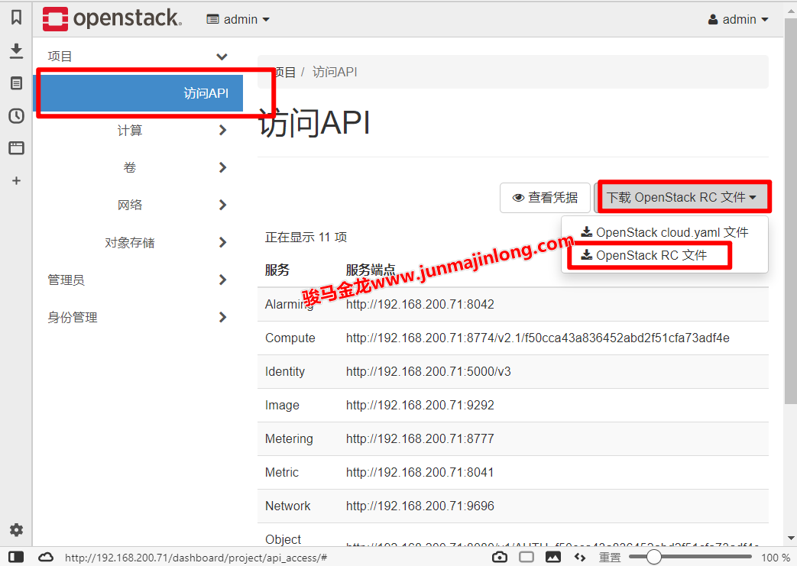

# 14. Ansible 管理 docker 和 openstack

- [14. Ansible 管理 docker 和 openstack](#14-ansible-管理-docker-和-openstack)
  - [14.1 Ansible 管理 docker](#141-ansible-管理-docker)
    - [14.1.1 Ansible 构建并运行 Docker 镜像](#1411-ansible-构建并运行-docker-镜像)
    - [14.1.2 无 Dockerfile 启动镜像并连接容器](#1412-无-dockerfile-启动镜像并连接容器)
    - [14.1.3 docker inventory](#1413-docker-inventory)
    - [14.1.4 其它 Ansible 容器管理工具](#1414-其它-ansible-容器管理工具)
  - [14.2 Ansible 管理 OpenStack](#142-ansible-管理-openstack)
    - [14.2.1 创建虚拟机](#1421-创建虚拟机)
    - [14.2.2 将新虚拟机动态添加到 inventory](#1422-将新虚拟机动态添加到-inventory)
    - [14.2.3 收集 OpenStack 虚拟机的动态 inventory](#1423-收集-openstack-虚拟机的动态-inventory)

## 14.1 Ansible 管理 docker

近年来 Linux 容器技术越来越受欢迎，通过容器技术，可以保持程序运行环境的一致性，快速启动并高效率运行，涉及到的开销也比较小，此外，在系统层次上完成容器级别的资源隔离非常快速。

Docker 是管理 Linux 容器最流行的工具，它为管理 Linux 容器提供了许多方便的工具，比如创建、销毁 Linux 容器，还提供了一些除管理 Linux 容器之外的工具，比如管理镜像、编排。通过它的易用性，Docker 已经成为管理容器的最流行的方法之一。

> 题外话：关于容器和 Docker
>
> Linux 容器是内核的几种功能组合在一起实现的。换句话说，Linux 容器技术是内核层次的功能，Docker 只是提供了一系列工具，包括从底层和内核交互到高层和用户交互的一条龙。除了 Docker 外，也还有其它操作 Linux 容器的工具，只是对大众来说，Docker 是最流行的。

Ansible 为 Docker 提供了一整套工具，包括相关模块、连接插件(ansible_connection: docker)和 inventory 脚本，因此 Ansible 可在许多方面与 Docker 进行交互。例如 Ansible 可构建 Docker 镜像、启动或停止容器、组合多个容器服务、连接到活动容器并与之交互，甚至可以从容器中获取 inventory。

如下是 Ansible 官方目前提供的和 Docker 相关的模块：

```
docker_compose – Manage multi-container Docker applications with Docker Compose
docker_config – Manage docker configs
docker_container – manage docker containers
docker_container_info – Retrieves facts about docker container
docker_host_info – Retrieves facts about docker host and lists of objects of the services
docker_image – Manage docker images
docker_image_info – Inspect docker images
docker_login – Log into a Docker registry
docker_network – Manage Docker networks
docker_network_info – Retrieves facts about docker network
docker_node – Manage Docker Swarm node
docker_node_info – Retrieves facts about docker swarm node from Swarm Manager
docker_prune – Allows to prune various docker objects
docker_secret – Manage docker secrets
docker_stack – docker stack module
docker_swarm – Manage Swarm cluster
docker_swarm_info – Retrieves facts about Docker Swarm cluster
docker_swarm_service – docker swarm service
docker_swarm_service_info – Retrieves information about docker services from a Swarm Manager
docker_volume – Manage Docker volumes
docker_volume_info – Retrieve facts about Docker volumes
```

要使用 Ansible 管理连接 Docker，要求安装如下包(注意：Ansible 端和 docker 端都安装，这一点和其它模块不一样，如报错，请自行在两端安装、卸载、升级调试)：

```shell
# 两端都安装，如果已经安装了，则在报错的情况下按需更新
# 此外，根据Ansible使用的python解释器版本，按需决定使用pip还是pip3，
# 如果需要的是pip，则yum install python-pip
$ pip3 install docker requests
```

如下是其中两次报错信息，注意其中的结尾：No module named ‘XXX’。

```shell
fatal: [192.168.200.71]: FAILED! => {"changed": false, "msg": "Failed to import the required Python library (Docker SDK for Python: docker (Python >= 2.7) or docker-py (Python 2.6)) on controller's Python /usr/bin/python3. Please read module documentation and install in the appropriate location. If the required library is installed, but Ansible is using the wrong Python interpreter, please consult the documentation on ansible_python_interpreter, for example via `pip install docker` or `pip install docker-py` (Python 2.6). The error was: No module named 'requests'"}

fatal: [192.168.200.71]: FAILED! => {"changed": false, "msg": "Failed to import the required Python library (Docker SDK for Python: docker (Python >= 2.7) or docker-py (Python 2.6)) on controller's Python /usr/bin/python3. Please read module documentation and install in the appropriate location. If the required library is installed, but Ansible is using the wrong Python interpreter, please consult the documentation on ansible_python_interpreter, for example via `pip install docker` or `pip install docker-py` (Python 2.6). The error was: No module named 'docker'"}
```

### 14.1.1 Ansible 构建并运行 Docker 镜像

通 Ansible 提供的 docker_image 模块可管理 Docker 镜像(比如构建、移除、pull 镜像)，使用 docker_container 模块可管理容器，比如将镜像运行起来成为容器。

对我们而言，一般都是在已有镜像的基础上通过 Dockerfile 来定义新的操作，然后构建出自己的 Docker 镜像。所以需要提供两个文件：一个基础镜像和一个 Dockerfile 文件(基础镜像不存在时会自动下载)。如果使用 Ansible 来构建镜像，那么这个 Dockerfile 文件需要能够被 Ansible 读取，比如可以放在 Ansible playbook 文件的同目录下。

为了演示以下 Ansible 构建 Docker 镜像，此处已经写好了一个非常简单的 Dockerfile，该 Docker 镜像是在 CentOS 7 镜像的基础上添加 nginx，然后让 nginx 运行起来并提供 cowsay 页面。

Dockerfile 内容如下：

```dockerfile
FROM centos:centos7
LABEL maintainer="junmajinlong.com"

RUN rm -rf /etc/yum.repos.d/*.repo && \
    echo -e ' \
[base] \n\
name=os \n\
baseurl=https://mirrors.huaweicloud.com/centos/$releasever/os/$basearch/ \n\
enable=1 \n\
gpgcheck=0 \n\
[epel] \n\
name=epel \n\
baseurl=https://mirrors.huaweicloud.com/epel/7Server/$basearch/ \n\
enable=1 \n\
gpgcheck=0 \n\
' >/etc/yum.repos.d/base.repo && \
    yum -y install cowsay nginx && \
    rm -rf /usr/share/nginx/html/index.html && \
    cowsay Junmajinlong >/usr/share/nginx/html/index.html && \
    echo 'daemon off;' >>/etc/nginx/nginx.conf && \
    yum clean all

EXPOSE 80

CMD /usr/sbin/nginx
```

然后写一个 Ansible 任务文件，假设名为 build_and_run_image.yaml，内容如下：

```yaml
- hosts: docker
  gather_facts: no
  tasks:
    - name: scp Dockerfile
      copy:
        src: Dockerfile
        dest: /tmp/Dockerfile

    - name: build Docker image centos_nginx:v0.1.1
      docker_image:
        name: centos_nginx
        source: build
        tag: v0.1.1
        build:
          path: /tmp
          pull: yes
    - name: start centos_nginx
      docker_container:
        name: cng
        image: centos_nginx:v0.1.1
        ports: 8080:80
        state: started
```

Ansible 执行完成上述任务后，可直接在 Ansible 端使用 curl 来测试页面是否可获取：

```
$ curl 192.168.200.71:8080
 ______________
< Junmajinlong >
 --------------
        \   ^__^
         \  (oo)\_______
            (__)\       )\/\
                ||----w |
                ||     ||
```

这里对上述两个模块稍作解释。

对于 docker_image 任务来说，通过 sourec: build 指令来表示这是一次镜像构建操作，source 指令可包含如下值：

- build：根据 build 指令的 path 参数指定的 Dockerfile 构建镜像

- load：从镜像 tar 文件中提取镜像
- pull： 从 registry 中拉取镜像
- local：保证 docker 端已经具备指定的镜像

对于 build 指令来说：

- path：指定构建时的上下文目录，该目录要求包含 Dockerfile 文件

- dockerfile：明确指定使用哪个 Dockerfile 文件，而不是默认的上下文目录中的 Dockerfile 文件
- pull：构建时是否从 registry 中拉取基础和中间镜像镜像
- cache_from：构建时使用缓存的中间镜像
- args：可按照 key:value 方式指定镜像的参数，对应于 Dockerfile 中的 ARG 指令，例如 listen_port: 8080

其它指令应该都通俗易懂。

构建镜像完成后，可使用 docker_container 模块启动该镜像。该模块指令非常非常多，几乎包含了 docker container 命令的所有选项功能，但是熟悉 docker 命令，这些指令的用法也通俗易懂。比如，指定卷和环境变量：

```yaml
- name: Create a data container
  docker_container:
    name: mydata
    image: busybox
    volumes:
      - /data

- name: Restart a container
  docker_container:
    name: myapplication
    image: someuser/appimage
    state: started
    restart: yes
    devices:
      - "/dev/sda:/dev/xvda:rwm"
    ports:
      - "8080:9000"
      - "127.0.0.1:8081:9001/udp"
    env:
      SECRET_KEY: "ssssh"
      BOOLEAN_KEY: "yes"
```

### 14.1.2 无 Dockerfile 启动镜像并连接容器

在上面的 playbook 中明确使用了 Dockerfile 来构建镜像并启动镜像提供服务，但因为 Dockerfile 自身也是基于基础镜像构建的，所以可以省略这个构建过程，而是直接启动基础镜像并连接到启动的容器进行操作。

下面实现与上述示例相同的效果，只是不使用 Dockerfile 构建。

playbook 文件内容如下：

```yaml
---
- name: start image
  hosts: docker
  gather_facts: no
  vars:
    container_name: "centos7"
  tasks:
    - name: start basic container "centos7"
      docker_container:
        name: "{{container_name}}"
        hostname: "{{container_name}}"
        image: centos:centos7
        ports: 8080:80
        state: started
        auto_remove: yes
        command: bash
        tty: yes

    - name: add container to inventory
      add_host:
        name: "{{container_name}}"
        ansible_connection: docker
        ansible_host: "{{container_name}}"
        ansible_user: root
        groups: containers

- name: do something in container
  hosts: containers
  gather_facts: no
  tasks:
    - name: install python if needed
      raw: yum install -y python

    - name: remove all repos exists
      shell: rm -rf /etc/yum.repos.d/*

    - name: add os repo and epel repo
      yum_repository:
        name: "{{item.name}}"
        description: "{{item.name}} repo"
        baseurl: "{{item.baseurl}}"
        file: "{{item.name}}"
        enabled: 1
        gpgcheck: 0
        reposdir: /etc/yum.repos.d
      loop:
        - name: os
          baseurl: "https://mirrors.huaweicloud.com/centos/$releasever/os/$basearch"
        - name: epel
          baseurl: "https://mirrors.huaweicloud.com/epel/$releasever/$basearch"

    - name: install nginx and cowsay
      shell: yum -y install nginx cowsay

    - name: configure nginx
      lineinfile:
        line: "daemon off;"
        dest: /etc/nginx/nginx.conf

    - name: change index page
      block:
        # 先移除index.html，因为它可能是一个软链接
        - name: remove old index.html page
          shell: |
            rm -rf /usr/share/nginx/html/index.html
            cowsay Junmajinlong >/usr/share/nginx/html/index.html

    - name: run nginx
      shell: nginx &
```

在执行上述 playbook 之前，需要先在 Ansible 端导出连接方式 docker 所在主机的环境变量，比如 Ansible 连接到远程 docker 时，使用 tcp:

```shell
$ export DOCKER_HOST=tcp://192.168.200.71:2376
$ ansible-playbook -i inventoryname playbookname.yaml
```

上面的 playbook 任务中，首先启动 docker 容器，然后使用了 connection: docker 连接器添加该容器到 containers 主机组中，以便后续的连接。之后在第二个 play 中连接到 containers 组，安装 Python(CentOS 系统都会带有 python)，配置 yum 源，安装 Nginx 和 cowsay，并启动 nginx。任务流程比较简单。

唯一需要关注的是 add_hosts 添加容器节点到 inventory 时指定的 docker 连接方式，这里不能使用默认的 ssh 连接方式，因为目标容器不一定开启了 ssh 服务，也不一定能和外界通信，而使用 connection: docker 连接方式，Ansible 将会先 ssh 连接到 docker 服务所在主机，然后通过 docker container exec 的方式连接到容器内部。

### 14.1.3 docker inventory

Ansible 为 Docker 提供了动态 inventory 的脚本。可下载该脚本：

```shell
wget https://raw.githubusercontent.com/ansible/ansible/stable-2.9/contrib/inventory/docker.py
chmod +x docker.py
```

执行该脚本测试：

```shell
DOCKER_HOST=tcp://192.168.200.71:2376 ./docker.py --pretty
```

或者直接在 ansible 命令或 ansible-playbook 命令中使用-i 选项指定:

```shell
ansible-playbook -i docker.py docker_containers.yml
```

### 14.1.4 其它 Ansible 容器管理工具

Ansible 除了在官方提供了 docker 相关的模块外，还有一些第三方的工具可用来管理容器。

比如 ansible-container、ansible-bender、Ansible Operator，它们需要单独安装，对于 ansible-container 来说，在之前几年比较知名，但是作者现在已经将该项目废弃，据作者本人所说，ansible-bender 和 Ansible Operator 更为优秀。

[ansible-bender](https://github.com/ansible-community/ansible-bender)：
简化 Ansible Playbook 构建容器(注：此容器是符合 OCI 标准的容器，docker 所构建的底层容器也是 OCI 容器)
[Ansible Operator](https://learn.openshift.com/ansibleop)：
是 Red Hat Ansible Automation 和 Red Hat OpenShift 团队联合开发的用来将容器部署到 K8s 上的工具

## 14.2 Ansible 管理 OpenStack

OpenStack 可整合一台或多台物理计算机的资源来按需创建、管理、配置、删除虚拟机(在 OpenStack 中，虚拟机对应的术语是”计算实例”，但后文都以虚拟机来描述)，对 OpenStack 提供者来说，提高了硬件资源的利用率；对受益用户来说，可按自己的需求申请带有各种性能、各种资源配置的操作系统，比如公有云的模式，就像去网吧上网一样，想上多久、想体验什么配置的主机都按需付费来享用。

对于 OpenStack 来说，Ansible 几乎是全程参与其发展的，因为从 OpenStack 很早的版本开始，就已经逐步支持通过 Ansible 来配置管理 OpenStack，而 Ansible 管理 OpenStack 相关的模块也随着 OpenStack 的版本迭代在不断更新。目前为止，Ansible 官方提供的关于 OpenStack 的模块已经有五十多个，下面是 Ansible 官方目前提供的模块列表信息简介：

```
os_auth – Retrieve an auth token
os_client_config – Get OpenStack Client config
os_coe_cluster – Add/Remove COE cluster from OpenStack Cloud
os_coe_cluster_template – Add/Remove COE cluster template from OpenStack Cloud
os_flavor_info – Retrieve information about one or more flavors
os_floating_ip – Add/Remove floating IP from an instance
os_group – Manage OpenStack Identity Groups
os_group_info – Retrieve info about one or more OpenStack groups
os_image – Add/Delete images from OpenStack Cloud
os_image_info – Retrieve information about an image within OpenStack
os_ironic – Create/Delete Bare Metal Resources from OpenStack
os_ironic_inspect – Explicitly triggers baremetal node introspection in ironic
os_ironic_node – Activate/Deactivate Bare Metal Resources from OpenStack
os_keypair – Add/Delete a keypair from OpenStack
os_keystone_domain – Manage OpenStack Identity Domains
os_keystone_domain_info – Retrieve information about one or more OpenStack domains
os_keystone_endpoint – Manage OpenStack Identity service endpoints
os_keystone_role – Manage OpenStack Identity Roles
os_keystone_service – Manage OpenStack Identity services
os_listener – Add/Delete a listener for a load balancer from OpenStack Cloud
os_loadbalancer – Add/Delete load balancer from OpenStack Cloud
os_member – Add/Delete a member for a pool in load balancer from OpenStack Cloud
os_network – Creates/removes networks from OpenStack
os_networks_info – Retrieve information about one or more OpenStack networks
os_nova_flavor – Manage OpenStack compute flavors
os_nova_host_aggregate – Manage OpenStack host aggregates
os_object – Create or Delete objects and containers from OpenStack
os_pool – Add/Delete a pool in the load balancing service from OpenStack Cloud
os_port – Add/Update/Delete ports from an OpenStack cloud
os_port_info – Retrieve information about ports within OpenStack
os_project – Manage OpenStack Projects
os_project_access – Manage OpenStack compute flavors access
os_project_info – Retrieve information about one or more OpenStack projects
os_quota – Manage OpenStack Quotas
os_recordset – Manage OpenStack DNS recordsets
os_router – Create or delete routers from OpenStack
os_security_group – Add/Delete security groups from an OpenStack cloud
os_security_group_rule – Add/Delete rule from an existing security group
os_server – Create/Delete Compute Instances from OpenStack
os_server_action – Perform actions on Compute Instances from OpenStack
os_server_group – Manage OpenStack server groups
os_server_info – Retrieve information about one or more compute instances
os_server_metadata – Add/Update/Delete Metadata in Compute Instances from OpenStack
os_server_volume – Attach/Detach Volumes from OpenStack VM’s
os_stack – Add/Remove Heat Stack
os_subnet – Add/Remove subnet to an OpenStack network
os_subnets_info – Retrieve information about one or more OpenStack subnets
os_user – Manage OpenStack Identity Users
os_user_group – Associate OpenStack Identity users and groups
os_user_info – Retrieve information about one or more OpenStack users
os_user_role – Associate OpenStack Identity users and roles
os_volume – Create/Delete Cinder Volumes
os_volume_snapshot – Create/Delete Cinder Volume Snapshots
os_zone – Manage OpenStack DNS zones
```

虽然看上去很多，但大致可总结为 Ansible 可对以下资源做管理:

1. 计算资源

2. 镜像管理
3. 账户管理和账户认证
4. 网络管理
5. 对象存储管理
6. 块存储管理

对每种资源的管理可分为四类操作：

1. 获取管理目标的信息

2. 添加管理目标
3. 修改管理目标的属性
4. 删除管理目标

即增、删、改、查。

此外，由于 OpenStack 自身已经跟踪了其创建的每个虚拟机的信息，所以 Ansible 还可以直接从 OpenStack 中获取这些虚拟机的信息，比如从 OpenStack 取得某些虚拟机信息来构建动态 inventory，这样就免去了手动提供虚拟机 inventory 的麻烦。

本文不会介绍 Ansible 如何操作 OpenStack 自身(比如添加网络、上传镜像等)，这和管理普通服务做的一些基本操作没任何区别，不同的仅仅只是做不同操作而已。本文会介绍 Ansible 管理 OpenStack 虚拟机时最常见的两种场景需求：

1. 使用 Ansible 创建虚拟机，然后像平时管理远程主机一样管理这些虚拟机，最后删除这些虚拟机
2. 从 OpenStack 生成动态 inventory

### 14.2.1 创建虚拟机

OpenStack 管理虚拟机相关的模块都以 os_server 开头，目前包括如下 6 个模块：本文大概只会用到 os_server 模块

```shell
os_server – 创建或删除虚拟机
os_server_action – 对虚拟机做一些操作，比如虚拟机的关机、开机、重启、暂停、恢复等操作
os_server_group – 管理OpenStack虚拟机分组，比如测试环境的虚拟机可属于test组，生成环境的虚拟机可属于prod组
os_server_info – 检索一或多个虚拟机信息，在Ansible2.9之前，该模块名称为os_server_facts，用于检索虚拟机facts信息
os_server_metadata – 增、删、改虚拟机的元数据信息，比如设置虚拟机的主机名、虚拟机设备信息，如网卡配置、磁盘路径/dev/sda
os_server_volume – 附加、剥离虚拟机的卷
```

这 6 个模块都要求先安装好版本高于 0.12 的 openstacksdk 包，在 CentOS 7 中只需执行如下命令即可：

```shell
pip3 install openstacksdk
```

为了让 Ansible 连接到 Controller 进行管理，需要添加 Controller 的 inventory 信息。假如 OpenStack 的 Controller 的 IP 地址为 192.168.200.71，可 inventory 文件 openstack 中添加如下内容：

```yaml
[openstack_controller]
192.168.200.71
```

配置 Ansible 段和 controller 的 ssh 认证互信可自行配置，此处不赘述。

然后就可以编写 playbook 来创建虚拟机，假如 playbook 文件名为 create_vm.yml，其内容如下：

```yaml
- name: create vm
  hosts: openstack_controller
  gather_facts: no
  tasks:
    - name: Create a new instance
      os_server:
        state: present
        auth:
          auth_url: http://192.168.200.71:5000/v3
          username: admin
          password: 81b3affc270b4835
          project_name: admin
          project_domain_name: "Default"
          user_domain_name: "Default"
        name: vm1
        image: "CentOS-7-x86_64"
        key_name: ansible_key
        timeout: 200
        flavor: m1.small
        network: "ext_net"
        wait: yes
        meta:
          hostname: test1
          group: test_group
          userdata: |
            #!/bin/bash
            cp  /home/centos/.ssh/authorized_keys /root/.ssh/
            
```

auth 部分是认证相关信息，name1 表示创建一个名为 vm1 的虚拟机，image、key_name、falvor、network 都是 OpenStack 中已经配置好的。这里还同时设置了虚拟机创建出来后的主机名为 test1，并加入到了 test_group 主机组。

因为是 CentOS 镜像系统，该虚拟机创建出来后，默认登录用户名为”centos”，而且默认不支持 root 登录，为了后续可以使用 root 登录，上面使用 userdata 定义了该虚拟机创建后自定义的操作，即将保存的公钥信息拷贝到/root/.ssh 目录下。

注意 os_server 创建虚拟机任务中的一项 wait: yes，它是默认选项，表示 Ansible 会等待虚拟机创建完成才会继续执行下面的任务。

因为所有的模块在连接 OpenStack 时都需要进行身份认证，为了简化 playbook 中的认证内容，将上面的 auth 选项段落的内容保存到 OpenStack Controller 的~/.config/openstack/clouds.yaml 文件中。例如：

```
clouds:
  mycloud:
    auth:
    	auth_url: http://192.168.200.71:5000/v3
    	username: admin
    	password: 81b3affc270b4835
    	project_name: admin
    	project_domain_name: "Default"
    	user_domain_name: "Default"
```

以后在模块选项中就可以省略 auth，而使用一个 cloud: CLOUDNAME 即可：

```yaml
tasks:
  - name: Create a new instance
    os_server:
      clouds: mycloud
      state: present
      name: vm1
      image: "CentOS-7-x86_64"
      key_name: ansible_key
      timeout: 200
      flavor: m1.small
      network: "ext_net"
      wait: yes
      meta:
        hostname: test1
        group: test_group
```

但是要注意，将认证信息以明文方式写入文件是不安全的，可以使用 Ansible 的 Valut 加密。不过 OpenStack 的 dashboard 中也已经提供了一个环境配置文件，可以先按照如图所示的位置下载：



然后以 source 的方式执行下载到的 admin-openrc.sh 脚本文件：

```shell
source admin-openrc.sh
```

执行完后，Ansible 的 OpenStack 相关模块执行时，auth 和 cloud 指令都可以省略。

上面只是创建一个虚拟机实例，但很多时候可能需要一次性创建多个虚拟机。可以将每个虚拟机相关信息定义到一个变量文件中，然后去遍历想要创建的虚拟机实例。例如：

```yaml
---
servers:
  - name: vm1
    image:
    flavor:
    key:
    nics:
    meta:
      hostname:
      group:
  - name: vm2
    image:
    flavor:
    key:
    nics:
    meta:
      hostname:
      group:
```

有了前面的 Ansible 基础后，此处批量创建虚拟机应该毫无难度。

创建虚拟机后，可以将 os_server 的任务注册到一个变量，从而可以获取该虚拟机的信息，包括该虚拟机的 IP 地址：

```yaml
tasks:
  - name: Create a new instance
    os_server:
      cloud: mycloud
      state: present
      name: vm1
      image: "CentOS-7-x86_64"
      key_name: ansible_key
      timeout: 200
      flavor: m1.small
      network: "ext_net"
      wait: yes
      meta:
        hostname: test1
        group: test_group
    register: newserver

  - name: get instance ip
    debug:
      var: newserver.openstack.accessIPv4
```

有了 IP 地址，对 Ansible 来说就获得了最关键的信息，因为只要将新虚拟机添加到 Ansible inventory 中，新虚拟机便像普通节点一样可接受 Ansible 的控制。

### 14.2.2 将新虚拟机动态添加到 inventory

获取到 IP 地址后，可以将该节点通过`add_host`模块动态加入到 inventory 中：

```yaml
- name: add new vm to inventory
  add_host:
    name: "{{ newserver.openstack.accessIPv4 }}"
    ansible_host: "{{ newserver.openstack.accessIPv4 }}"
    ansible_user: "centos"
    ansible_port: 22
    groups:
      - vm_hosts
```

似乎这里的逻辑不太良好？如果虚拟机启动了但是不可连接呢？对于 OpenStack 创建的虚拟机来说，完全不用担心，因为 os_server 创建虚拟机成功后会等待该虚拟机可连接才真正返回。但对于非 OpenStack 的其它云主机实例则不一定，这时应当使用 wait 或 wait_for_connection 模块定义一个等待任务。尽管 OpenStack 中可以省略该步骤，但在脑海中应当要知道有这个步骤。

此外，OpenStack 安装的镜像系统可能是比较精简的系统，甚至没有安装 Python，所以为了能管理这些虚拟主机，应先使用 raw 模块安装 Python。

```yaml
- name: for new vm host
  hosts: vm_hosts
  gather_facts: no
  tasks:
    - name: install python if needed
      raw: "sudo yum install -y python"
```

如此，Ansible 便可以像管理普通主机一样管理 OpenStack 虚拟机。

### 14.2.3 收集 OpenStack 虚拟机的动态 inventory

动态 inventory 一般需要写脚本(几乎是 Python 脚本)来收集，但即使不会 Python 也不用担心，因为对于 OpenStack 来说，官方已经提供了 openstack 插件，还提供了 openstack_inventory.py 脚本，该脚本位于 Ansible 官方 github 仓库的 contrib/inventory 目录下，查看文件时记得先选择对应 Ansible 版本的分支。

下载 openstack_inventory.py 并设置可执行权限：

```shell
wget https://raw.githubusercontent.com/ansible/ansible/stable-2.9/contrib/inventory/openstack_inventory.py
chmod +x openstack_inventory.py
```

然后 source 以下 admin-openrc.sh 脚本，再执行：

```shell
source admin-openrc.sh
./openstack_inventory.py --list
```

可查看 inventory 信息。

之后要将该脚本在 ansible 或 ansible-playbook 中使用，使用-i 选项指定即可：

```shell
ansible-playbook -i openstack_inventory.py -m ping
```

除了使用 openstack_inventory.py 脚本动态生成 inventory 外，还可以使用名为”openstack”的 inventory 插件。要使用 openstack inventory 插件，首先要在/etc/ansible.cfg 中的[inventory]段的 enable_plugins 中开启 script 功能：

```shell
$ grep 'enable_plugins' /etc/ansible/ansible.cfg
#enable_plugins = host_list, virtualbox, yaml, constructed
```

取消上面的注释，加上 script:

```ini
[inventory]
enable_plugins = host_list, script, ini, virtualbox, yaml, constructed
```

以后只需在 yml 文件中加上如下 plugin 指令即可：

```yaml
plugin: openstack
```

关于 openstack plugin 的用法，参考该插件的[官方手册](https://docs.ansible.com/ansible/latest/plugins/inventory/openstack.html)。
